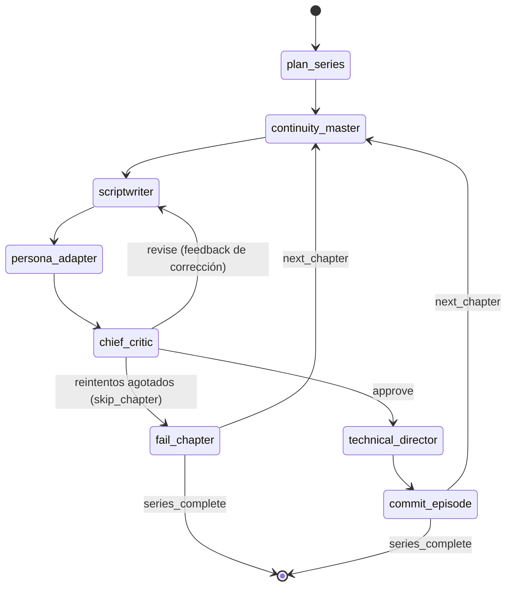

# Sinnema — Arquitectura del sistema

**Motor multi-proyecto que genera series completas de micro-videos verticales mediante un pipeline multi-agente de LLMs.**

Cada *proyecto* (show) concentra su política editorial en un archivo de
configuración. A partir de un tema, el motor **planifica la serie, emite
directivas de continuidad, escribe los guiones, los adapta al público
objetivo, los audita con ciclos de crítica, genera el paquete técnico de
producción y consolida todo** en un entregable JSON listo para render — con
memoria de continuidad persistente entre corridas y una pista de auditoría de
cada ejecución.

- **Stack:** Python ≥ 3.11 · Pydantic v2 · LangGraph · LangChain
- **Proveedores LLM:** Anthropic (Claude), OpenAI (GPT-4o), Google (Gemini) y Ollama local, con fallback entre proveedores
- **Garantía central:** ningún artefacto generado por un LLM circula por el pipeline sin pasar por contratos de dominio validados

---

## Tabla de contenidos

1. [Qué entra y qué sale](#1-qué-entra-y-qué-sale)
2. [Principio arquitectónico: hexagonal](#2-principio-arquitectónico-hexagonal)
3. [El pipeline multi-agente](#3-el-pipeline-multi-agente)
4. [El estado del grafo](#4-el-estado-del-grafo)
5. [Generación estructurada por rol](#5-generación-estructurada-por-rol)
6. [Proyectos: la unidad de reutilización](#6-proyectos-la-unidad-de-reutilización)
7. [El sobre editorial: tres niveles de límites](#7-el-sobre-editorial-tres-niveles-de-límites)
8. [Validación en profundidad](#8-validación-en-profundidad)
9. [Memoria de continuidad (lore)](#9-memoria-de-continuidad-lore)
10. [Ciclo de calidad y políticas de agotamiento](#10-ciclo-de-calidad-y-políticas-de-agotamiento)
11. [Entregable final](#11-entregable-final)
12. [Auditoría de ejecución](#12-auditoría-de-ejecución)
13. [Proveedores LLM y configuración](#13-proveedores-llm-y-configuración)
14. [Composition root: la CLI](#14-composition-root-la-cli)
15. [Estructura del repositorio](#15-estructura-del-repositorio)
16. [Estrategia de pruebas](#16-estrategia-de-pruebas)
17. [Puntos de extensión](#17-puntos-de-extensión)
18. [Distribución: paquete, servicio web y multi-usuario](#18-distribución-paquete-servicio-web-y-multi-usuario)

---

## 1. Qué entra y qué sale

**Entrada:**

- Un **proyecto** (`proyectos/<id>.toml`): identidad de marca, concepto del
  show, idioma, audiencia, contexto cultural, tono de voz, guía de estilo,
  restricciones, estilo visual maestro y el sobre editorial numérico.
- Una **petición de serie** (`SeriesRequest`): tema (opcional; si no, el tema
  por defecto del proyecto), número de capítulos y tope de reintentos de crítica.

**Salida:**

- Un **entregable** (`SeriesDeliverable`) en JSON: episodios aprobados (cada
  escena con narración final + prompt de imagen + dirección de movimiento),
  capítulos descartados con su motivo, score medio de calidad y glosario de
  lore de la serie.
- Una **carpeta de auditoría** en texto plano con cada paso de la ejecución.
- El **lore consolidado** del proyecto, persistido para la siguiente corrida.

Todo artefacto intermedio (plan, directivas, borradores, adaptaciones,
dictámenes, paquetes técnicos) es un contrato Pydantic del dominio.

---

## 2. Principio arquitectónico: hexagonal

El sistema se organiza en tres capas con la regla de dependencias apuntando
siempre hacia dentro:

```
┌──────────────────────────────────────────────────────────────┐
│  infrastructure  ·  adaptadores concretos                    │
│  CLI (composition root) · gateway LLM · carga TOML ·         │
│  almacén de lore JSON · pista de auditoría en disco          │
└──────────────╥───────────────────────────────────────────────┘
               ║  implementa puertos / invoca casos de uso
┌──────────────╨───────────────────────────────────────────────┐
│  application  ·  orquestación y política de producto         │
│  grafo LangGraph · caso de uso · prompts por rol ·           │
│  ProjectSpec · SeriesRequest · PUERTOS (Protocol)            │
└──────────────╥───────────────────────────────────────────────┘
               ║  dependencia hacia dentro
┌──────────────╨───────────────────────────────────────────────┐
│  domain  ·  núcleo puro, sin I/O ni LLM                      │
│  contratos Pydantic · servicios de dominio · constantes ·    │
│  excepciones                                                 │
└──────────────────────────────────────────────────────────────┘
```

- **`domain`** no conoce ningún framework: define las entidades de los
  artefactos, los límites universales y la lógica de negocio pura
  (validaciones de formato, coherencia cruzada, gestión de lore).
- **`application`** define los **puertos** que el núcleo necesita del mundo
  exterior — `StructuredGenerationPort`, `LoreStorePort`, `AuditTrailPort`
  (Protocolos Python) — y jamás importa un adaptador concreto. Esto permite
  testear todo el grafo con dobles en memoria.
- **`infrastructure`** implementa esos puertos: el gateway LLM sobre LangChain,
  el cargador de proyectos TOML, el almacén de lore en JSON y la pista de
  auditoría en el sistema de archivos.
- La **CLI** es el único *composition root*: el único módulo que arma el mundo
  (carga proyecto, entorno, adaptadores y caso de uso).

---

## 3. El pipeline multi-agente

La producción de una serie es un **grafo de estado cíclico** (LangGraph) con
seis roles de agente. Cada rol tiene su propio system prompt parametrizado por
proyecto, su modelo LLM y su contrato de salida.

| Rol | Agente | Responsabilidad | Contrato que devuelve |
|---|---|---|---|
| `planner` | Strategic Planner | Plan macro de la serie: capítulos, curva de dificultad progresiva, elementos recurrentes | `SeriesPlan` |
| `continuity` | Lore Keeper | Directivas de continuidad por capítulo a partir del lore acumulado | `ContinuityDirectives` |
| `scriptwriter` | Content Creator | Borrador del guion del capítulo (hook, escenas, CTA) | `ScriptDraft` |
| `adapter` | Audience Adapter | Reescritura al registro y cultura del público objetivo | `AdaptedScript` |
| `critic` | Chief Auditor | Dictamen de calidad booleano + feedback accionable | `QualityAudit` |
| `technical_director` | Visual/Audio Director | Specs visuales en inglés, dirección de audio y miniatura | `TechnicalPackage` |

### Topología del grafo



Propiedades de diseño:

- **El grafo se compila por proyecto.** Los nodos cierran sobre el
  `ProjectSpec` (prompts del rol + perfil editorial), de modo que cada show
  produce su propio pipeline sin tocar código.
- **Cada nodo es una función pura sobre el estado:** pide al puerto de
  generación la salida estructurada de su rol, la valida contra el perfil del
  proyecto y contra las reglas cruzadas de dominio, y devuelve únicamente las
  claves que modifica.
- **El único ciclo es el de crítica.** Si el auditor rechaza, su feedback
  vuelve al guionista como `pending_feedback`, con un tope de reintentos y una
  política de agotamiento configurable (ver §10).
- **El `commit_episode` es el iterador de lotes:** consolida el episodio,
  extrae el lore nuevo, limpia los borradores del capítulo y avanza el puntero
  hasta el siguiente capítulo o el fin de la serie.

---

## 4. El estado del grafo

Todo el pipeline comparte un único `PipelineState` (un `TypedDict` organizado
en capas):

1. **Input:** parámetros de la corrida y proyección del proyecto (idioma,
   tono, tema, audiencia, guía de estilo, restricciones).
2. **Plan macro:** el plan de serie aprobado.
3. **Memoria de lore:** lista **append-only** (reducer `operator.add`): los
   nodos nunca sobrescriben la historia acumulada.
4. **Runtime:** puntero de capítulo actual, contador de reintentos, y los
   artefactos en curso del capítulo (directivas, borrador, adaptación,
   dictamen, paquete técnico).
5. **Output:** episodios aprobados y capítulos fallidos, también append-only.

Los nodos devuelven **actualizaciones parciales** que LangGraph fusiona; los
reducers garantizan que los acumuladores no pierdan historia. El estado
inicial se construye desde la petición validada y se **siembra con el lore
persistido** del proyecto, de modo que la continuidad sobrevive entre corridas.

---

## 5. Generación estructurada por rol

Un único catálogo (`ROLE_SCHEMAS`) conecta cada rol con el esquema Pydantic
que debe devolver. Sobre eso:

- **El adaptador LLM** (`LangChainStructuredGateway`) vincula cada rol con su
  cliente y su esquema mediante `with_structured_output`, reintenta fallos
  transitorios con backoff y **detecta wiring erróneo**: roles desconocidos,
  roles sin cliente, o peticiones cuyo esquema no coincide con el del rol.
- **La aplicación solo conoce el puerto** `StructuredGenerationPort`: recibe
  prompts ya construidos y devuelve una instancia validada del esquema pedido.
- **Los prompts son política de la aplicación**, no de infraestructura: cada
  rol vive en su módulo con el contrato `build_system_prompt(spec)` +
  `build_user_message(...)`. Inyectan la identidad del show, el sobre
  editorial numérico (presupuestos de palabras y duración) y los datos de la
  corrida; el *cómo* (transporte, reintentos, proveedor) queda en los
  adaptadores.

---

## 6. Proyectos: la unidad de reutilización

Un proyecto (show) es un archivo TOML con seis secciones:

| Sección | Contenido |
|---|---|
| `[proyecto]` | id (slug), marca, concepto del show, tema por defecto, idioma |
| `[voz]` | audiencia, contexto cultural, tono, guía de estilo, restricciones |
| `[visual]` | estilo visual maestro (en inglés, para los modelos de imagen) |
| `[formato]` | sobre editorial numérico — **opcional**; sin él rige el perfil por defecto (vertical ~60 s) |
| `[flujo]` | qué agentes participan, en qué orden y **hasta dónde llega** la corrida — **opcional**; sin él rige la topología por defecto |
| `[agentes.<rol>]` | reglas, proveedor/modelo/temperatura, activación — y, para **agentes custom**, `tipo` + `contrato` + `entradas` + `instrucciones` |

Puntos clave:

- El mapeo TOML → `ProjectSpec` es **puro** (sin I/O): la infraestructura lee
  el archivo; la aplicación decide qué es un proyecto válido.
- La validación de un proyecto **reporta todos los problemas de una vez**,
  no el primero que encuentra.
- El `project_id` es un slug estable que **nombra las carpetas de salida**:
  entregables, auditoría y lore viven separados por proyecto.
- El perfil editorial se valida por coherencia al cargar: los rangos duros
  deben envolver a los objetivos, y todo debe caber en los límites universales.

### Flujo y alcance por proyecto (`[flujo]`)

Sin la sección, todos los shows usan la topología por defecto. Con ella, cada
show elige **qué agentes participan, en qué orden y hasta dónde llega**:

```toml
[flujo]
contexto        = ["continuity", "fact_checker"]  # fase pre-escritura
transformaciones = ["adapter"]                     # tras el escritor
revisor          = "critic"                        # compuerta (opcional)
enriquecimiento  = ["technical_director"]          # post-aprobación
hasta            = "produccion"                    # alcance de la corrida
```

El `hasta` corta la cadena en un hito del vocabulario cerrado
(`plan < guion < guion_final < auditado < produccion`): un show puede entregar
solo el outline (`plan`), los borradores (`guion`), el guion final **sin specs
de video** (`guion_final`), el guion con dictamen (`auditado`) o el paquete
completo con los prompts finales (`produccion`, el default). El entregable
reporta el alcance en su campo `alcance` (`schema_version 1.1`), y la CLI
puede sobreescribirlo por corrida con `--hasta`. Con `[flujo]` declarado, la
lista manda (los roles `activo = false` listados son un error); los agentes
`escritor` (`scriptwriter`) y el planificador son estructurales y siempre
participan.

### Agentes custom: agentes nuevos sin tocar código

Cualquier rol nuevo se define íntegramente en el TOML del proyecto —o desde la
web— declarando su `tipo`, su `contrato` genérico de salida, las `entradas`
(bloques del estado que recibe) y sus `instrucciones` (prompt base con
placeholders como `{marca}`):

```toml
[agentes.fact_checker]
tipo          = "contexto"          # contexto | enriquecedor | revisor
contrato      = "notas"             # notas | texto | dictamen (solo revisor)
entradas      = ["capitulo", "lore"]
instrucciones = "Eres el verificador de datos de {marca}. ..."

[flujo]
contexto = ["continuity", "fact_checker"]   # se lista como cualquier rol
```

Los contratos genéricos (`notas`, `texto`) validan la salida como cualquier
Pydantic; el `dictamen` de un revisor custom es directamente el
`QualityAudit` de dominio (la compuerta depende de esa semántica). Los
artefactos de contexto/enriquecimiento viajan como adjuntos del episodio.
Límites: no hay agentes custom `escritor`/`transformador` (exigen contratos de
guion tipados) ni validación cruzada entre agentes (eso es territorio de los
agentes de código).

---

## 7. El sobre editorial: tres niveles de límites

El sistema controla el formato de los videos con tres niveles cooperantes:

1. **Universales** (`domain.constants`): pisos y techos de sanidad que
   cualquier proyecto debe respetar (p. ej. narrado 30–600 palabras, total
   10–180 s, 1–12 escenas, capítulos ≤ 20). Los aplican los **contratos
   Pydantic** de los artefactos: rechazan basura estructural antes de que
   circule por el pipeline.
2. **Editoriales** (`FormatProfile` del proyecto): rangos concretos por métrica
   — relación de aspecto, palabras narradas (rango objetivo + rango duro),
   cantidad de escenas, duración por escena, duración total, techo de palabras
   por escena, techo de texto en pantalla, score mínimo de aprobación. Los
   aplica el **pipeline tras cada generación** (`domain.services.format`).
3. **Objetivos** (campos `*_target_*`): instruyen los prompts y los **audita
   el crítico**; no invalidan un artefacto por sí solos.

Esta estratificación permite que cada show afine su formato (p. ej. un
formato de 30 s con 4 escenas) sin que un LLM desbordado rompa el sistema.

---

## 8. Validación en profundidad

La defensa contra salidas defectuosas del LLM es por capas:

- **Contratos auto-validados:** cada artefacto recalcula sus propias métricas
  (`word_count`, duración total) y verifica invariantes internas: numeración
  de escenas secuencial desde 1, dificultad de la serie **no decreciente**,
  prerrequisitos que no solapen conceptos propios, dictámenes coherentes (un
  aprobado no puede llevar hallazgos bloqueantes; un rechazo debe estar
  justificado).
- **Coherencia cruzada entre agentes** (`domain.services.assembly`): el plan
  devuelve exactamente los capítulos pedidos; el guion adaptado conserva la
  numeración de escenas del borrador; el paquete técnico cubre exactamente
  esas mismas escenas; todos los artefactos del episodio comparten el
  `chapter_id`. Si dos agentes mezclan artefactos, se detecta en el acto.
- **Sobre editorial** (`domain.services.format`): tras cada generación se
  contrasta el artefacto contra el perfil del proyecto, acumulando todas las
  violaciones en una sola pasada.
- **Prompts de imagen en inglés:** los specs visuales (prompts de imagen,
  negativos, movimiento, miniatura) rechazan caracteres españoles — están
  destinados a modelos de imagen/video, no a personas.

Cualquier fallo de validación lanza un `DomainValidationError` **rápido y
accionable** (qué viola, qué se esperaba) y queda registrado en la auditoría.

---

## 9. Memoria de continuidad (lore)

Cada proyecto persiste un **glosario acumulativo** — el lore — que hace que
las series tengan continuidad entre capítulos *y entre corridas*:

- **Qué es:** términos canónicos (conceptos, personajes, referencias) con su
  definición, el capítulo donde se introdujeron y una categoría.
- **Ciclo de vida:** se **carga** al empezar la corrida (siembra el estado
  inicial), se **amplía** de forma append-only durante la ejecución y se
  **consolida** al terminar, fusionando con deduplicación
  (case-insensitive) contra lo ya almacenado.
- **Extracción determinista:** el lore nuevo se deduce de los conceptos clave
  del capítulo y de los términos nuevos declarados por el Lore Keeper — no de
  texto libre del LLM.
- **Consumo:** el nodo de continuidad convierte el glosario en
  `ContinuityDirectives` por capítulo: puente narrativo con el capítulo
  anterior, conceptos ya cubiertos (**prohibido re-explicarlos**), callbacks
  permitidos y términos nuevos (que no pueden solapar con los ya cubiertos).
- **Semántica de fallo:** leer un lore corrupto **aborta en voz alta** (la
  historia es valiosa: no se pierde en silencio); fallar al escribir es
  best-effort y nunca tumba una corrida que ya produjo episodios.

---

## 10. Ciclo de calidad y políticas de agotamiento

El auditor evalúa cada guion adaptado sobre dimensiones fijas (ritmo,
presupuesto, adherencia a audiencia, continuidad, claridad, cierre) y emite
un dictamen estructurado: veredicto booleano, score 0–10, estado del
presupuesto de palabras, hallazgos con severidad y corrección sugerida,
violaciones de continuidad y feedback accionable.

- **Semántica de aprobación reforzada:** un dictamen aprobado exige además el
  score mínimo del proyecto (perfil editorial) y presupuesto de palabras en
  rango; un rechazo exige al menos un hallazgo que lo justifique.
- **Bucle de corrección:** el rechazo inyecta el feedback al guionista y el
  capítulo se re-escribe, con un tope de reintentos (1–5, por defecto 2).
- **Política de agotamiento** (`PipelineSettings`):
  - `force_accept` (por defecto): el episodio se consolida marcado con
    `forced_acceptance` — best-effort, visible en auditoría y resumen.
  - `skip_chapter`: el capítulo se descarta y se registra un
    `FailedChapterRecord` con el motivo y el último feedback, y la serie sigue.

El límite de recursión del grafo se calcula a partir de capítulos × reintentos,
de modo que el ciclo de crítica nunca lo agote silenciosamente.

---

## 11. Entregable final

El `commit_episode` de cada capítulo **ensambla** el episodio aprobado:
consolida las escenas del borrador con la narración adaptada encima y las
specs técnicas por escena, y adjunta el paquete técnico completo y el
dictamen de calidad.

El entregable de serie (`SeriesDeliverable`, `schema_version 1.0`) se valida
por consistencia global al construirse:

- posiciones de episodio secuenciales desde 1, sin huecos ni repeticiones;
- ningún capítulo aprobado y descartado a la vez; el total reportado nunca
  supera lo planificado;
- el score medio declarado coincide con el promedio recalculado.

Se exporta como JSON (`ensure_ascii=False`, UTF-8) pensado para APIs, motores
de render o persistencia posterior.

---

## 12. Auditoría de ejecución

Cada corrida crea su carpeta (`auditoria/<project_id>/serie_<timestamp>/`)
con:

- `log.txt`: log cronológico con marca de tiempo de todo lo ocurrido;
- `NNN_<paso>.txt`: un archivo por paso completado, con descripción,
  detalles y el **artefacto generado volcado en JSON**.

La auditoría es un **observador puro**: nunca altera el resultado ni puede
tumbar una ejecución; si el sistema de archivos falla, se desactiva con un
warning y el pipeline continúa.

---

## 13. Proveedores LLM y configuración

Cada rol tiene una asignación por defecto de proveedor/modelo/temperatura,
elegida por el carácter de la tarea:

- **Análisis y control** (planificación, continuidad, crítica): temperaturas
  bajas (0.0–0.2) — Claude para planificar y auditar, GPT-4o-mini para las
  directivas de continuidad.
- **Redacción y adaptación** (guion, registro): GPT-4o y GPT-4o-mini con
  temperaturas altas (0.7–0.8).
- **Traducción visual** (specs técnicas): Gemini (temperatura 0.4).
- **Ollama** como refugio local sin credenciales, presente en la cadena de
  fallback de todos los roles.

Mecanismos de configuración:

- **Overrides por rol vía entorno:** `LLM_PROVIDER_<ROL>` y `LLM_MODEL_<ROL>`
  (p. ej. `LLM_PROVIDER_SCRIPTWRITER=ollama`).
- **Disponibilidad:** proveedor usable = paquete LangChain instalado +
  credenciales presentes (`ANTHROPIC_API_KEY`, `OPENAI_API_KEY`,
  `GOOGLE_API_KEY`/`GEMINI_API_KEY`; Ollama no requiere clave).
- **Cadena de fallback por rol:** si el proveedor primario no está
  disponible, se cae al siguiente de la lista, avisando por log. Si un rol se
  queda sin proveedor, el arranque aborta con instrucciones accionables.
- Carga opcional de `.env` vía `python-dotenv`.

Este módulo es el **único lugar del sistema** que conoce paquetes concretos
de LangChain.

---

## 14. Composition root: la CLI

`main.py` es un punto de entrada delgado; toda la lógica vive en
`infrastructure.cli.main`, el único módulo que arma el mundo completo:

1. parsea argumentos y configura logging;
2. carga y valida el proyecto TOML;
3. construye la petición de serie validada;
4. resuelve el gateway LLM (proveedores + fallbacks);
5. instancia auditoría y almacén de lore;
6. compila el caso de uso `GenerateSeriesUseCase` (que a su vez compila el
   grafo del proyecto);
7. **ejecuta con streaming**: imprime el progreso tras cada superstep del grafo;
8. consolida el entregable, persiste el lore, exporta el JSON y escribe el
   resumen final (episodios, scores, descartados, rutas de salida).

```text
Uso:
  python main.py                                 # proyecto por defecto, 3 capítulos
  python main.py -t "Tema de la serie" -n 5      # tema explícito
  python main.py -p <id> -n 4 -m 3               # proyecto, capítulos, reintentos
  python main.py -o ruta/salida.json -v          # salida y logging DEBUG
  python main.py --list-projects                 # cataloga los shows disponibles
```

Artefactos en disco tras una corrida:

```text
salidas/<project_id>/serie_<timestamp>.json   # entregable
auditoria/<project_id>/serie_<timestamp>/     # pista de auditoría
continuidad/<project_id>/lore.json            # memoria de continuidad
```

---

## 15. Estructura del repositorio

```text
sinnema/
├── main.py                        # punto de entrada delgado
├── proyectos/                     # un <id>.toml por show (datos, no código)
├── sinnema/
│   ├── domain/                    # núcleo puro (sin I/O ni LLM)
│   │   ├── constants.py           #   límites universales de sanidad
│   │   ├── exceptions.py          #   DomainValidationError
│   │   ├── text.py                #   utilidades de conteo/detección de texto
│   │   ├── models/                #   contratos Pydantic de cada artefacto
│   │   │   ├── planning.py        #     SeriesPlan, ChapterOutline
│   │   │   ├── continuity.py      #     ContinuityDirectives, LoreEntry
│   │   │   ├── content.py         #     ScriptDraft, AdaptedScript, escenas
│   │   │   ├── audit.py           #     QualityAudit, hallazgos
│   │   │   ├── technical.py       #     TechnicalPackage, specs visuales/audio
│   │   │   ├── deliverable.py     #     ApprovedEpisode, SeriesDeliverable
│   │   │   └── project.py         #     FormatProfile (sobre editorial)
│   │   └── services/              #   lógica pura: format, assembly, lore
│   ├── application/               # orquestación y política de producto
│   │   ├── graph.py               #   nodos + aristas condicionales (LangGraph)
│   │   ├── state.py               #   PipelineState (TypedDict + reducers)
│   │   ├── ports.py               #   puertos, roles y ROLE_SCHEMAS
│   │   ├── use_cases.py           #   GenerateSeriesUseCase + build_deliverable
│   │   ├── projects.py            #   ProjectSpec + mapeo TOML → spec
│   │   ├── requests.py            #   SeriesRequest + estado inicial
│   │   ├── settings.py            #   PipelineSettings (ciclo de crítica)
│   │   └── prompts/               #   system/user prompts por rol
│   └── infrastructure/            # adaptadores concretos
│       ├── cli/main.py            #   CLI + composition root
│       ├── llm/                   #   gateway LangChain + resolución de proveedores
│       ├── projects/loader.py     #   descubrimiento y carga de TOML
│       ├── lore/store.py          #   JsonLoreStore (LoreStorePort)
│       └── audit/filesystem.py    #   FilesystemAuditTrail (AuditTrailPort)
└── tests/                         # una suite por capa, sin red
```

---

## 16. Estrategia de pruebas

La suite cubre cada capa de forma aislada y sin red:

- **Contratos de dominio:** cada modelo con sus invariantes y casos límite.
- **Servicios puros:** validación de formato, coherencia cruzada de
  ensamblaje, extracción y fusión de lore.
- **Aplicación:** petición/ajustes, prompts parametrizados por proyecto,
  caso de uso y **el grafo completo** con un gateway falso en memoria
  (incluye los caminos de revisión, aceptación forzada y descarte).
- **Infraestructura:** gateway (wiring, reintentos), resolución de
  proveedores, almacén de lore, pista de auditoría, cargador de proyectos y
  CLI de punta a punta con puertos nulos (`NullAuditTrail`, `NullLoreStore`).

La regla de dependencias hexagonal es lo que hace esto posible: el núcleo se
testea con dobles porque solo conoce puertos.

---

## 17. Puntos de extensión

| Quiero… | Cómo |
|---|---|
| Crear un show nuevo | Añadir un `<id>.toml` en `proyectos/` — sin tocar código |
| Cambiar el formato de un show | Ajustar su sección `[formato]` (o quitarla para el perfil por defecto) |
| Añadir un rol de agente | Constante + esquema en `ports.py`, módulo de prompts, nodo + aristas en `graph.py`, `RoleSpec` en `providers.py` |
| Añadir un proveedor LLM | Extender `infrastructure/llm/providers.py` (import con guarda, disponibilidad y builder) |
| Otro almacenamiento de lore/auditoría (BD, S3…) | Implementar `LoreStorePort` / `AuditTrailPort` — la aplicación no cambia |
| Otra interfaz (API, web, cola) | Reutilizar `GenerateSeriesUseCase` y `build_deliverable`; la CLI es solo un cliente más |
| Otra política de calidad | `PipelineSettings`: reintentos (1–5) y política de agotamiento (`force_accept` / `skip_chapter`) |

---

## 18. Distribución: paquete, servicio web y multi-usuario

El motor se distribuye de dos formas sobre el mismo núcleo hexagonal.

### Instalación como paquete

```bash
pip install sinnema            # o: pip install "sinnema[server]" para el servicio web
sinnema --list-projects        # CLI completo, con los shows de ejemplo incluidos
sinnema -p motores -t "Motores híbridos" -n 4
```

El paquete viaja con los proyectos de ejemplo; en despliegues se apunta a un
directorio propio con `SINNEMA_PROJECTS_DIR=/ruta/a/proyectos`. Los shows en
desarrollo se leen desde `proyectos/` en la raíz del repo (resolución en
cascada: variable de entorno → repo → paquete).

### Servicio web (API + UI)

```bash
pip install "sinnema[server]"
sinnema-server                 # http://127.0.0.1:8000
```

La web (sirvida en `/`) tiene tres pestañas: **Proyectos** (crear, editar,
duplicar, eliminar, ver prompts compuestos y lore), **Generar serie** (elegir
show, tema y capítulos, con progreso en vivo) y **Trabajos** (jobs con estado
y enlaces al visor). La API:

| Endpoint | Qué hace |
|---|---|
| `GET /api/health` | Estado del servicio y del worker |
| `GET /api/projects` | Shows disponibles (con `editable`) |
| `GET /api/projects/{id}` | Definición cruda del proyecto (forma del TOML) |
| `POST /api/projects` | Crea un proyecto (valida todo junto; 400 con problemas) |
| `PUT /api/projects/{id}` | Sobreescribe un proyecto (id inmutable) |
| `DELETE /api/projects/{id}` | Borra el archivo (409 si hay jobs activos) |
| `GET /api/projects/{id}/prompts` | Vista previa de los prompts del sistema compuestos |
| `GET/DELETE /api/projects/{id}/lore` | Ver / reiniciar la memoria de continuidad |
| `GET /api/meta/roles` | Catálogo de agentes (desactivables, defaults LLM) |
| `POST /api/series` | Crea un job de generación (202, devuelve `job_id`) |
| `GET /api/jobs` | Jobs del usuario (header `X-Owner`, filtro `?project_id=`) |
| `GET /api/jobs/{id}` | Estado, error o entregable del job |
| `GET /api/jobs/{id}/events` | Progreso en vivo (Server-Sent Events) |
| `GET /api/jobs/{id}/deliverable` | JSON del `SeriesDeliverable` |
| `GET /api/jobs/{id}/viewer` | Visor HTML de la serie |

Variables de entorno del servicio: `SINNEMA_DATA_DIR` (raíz de jobs,
checkpoints, auditoría, lore y salidas; por defecto `datos-servidor/`),
`SINNEMA_HOST` y `SINNEMA_PORT`.

### Gestión web de proyectos: los archivos son la fuente de verdad

La web de gestión edita los mismos `proyectos/<id>.toml` que lee el pipeline
(escritura atómica con `tomli-w`). Cada job carga el spec vigente desde disco
al arrancar: cambiar un proyecto aplica a la próxima corrida, sin reiniciar.
La spec completa del MVP está en [`docs/spec-gestion-web.md`](docs/spec-gestion-web.md);
lo esencial del esquema:

```toml
[agentes.scriptwriter]          # planner, continuity, scriptwriter, adapter,
reglas = ["Cerrar con dato verificable"]   # critic, technical_director
temperatura = 0.9               # opcional (0.0-2.0)
# proveedor / modelo            # opcional: override por rol

[agentes.adapter]
activo = false                  # desactiva el agente (planner y scriptwriter no)

[pipeline]
# intentos_maximos_de_critica = 3          # default cuando la corrida no lo fija
# politica_al_agotar = "aceptar_forzado"   # o "saltar_capitulo"
```

- **Reglas**: se apendan al prompt del sistema del rol (bloque
  `REGLAS ADICIONALES DEL PROYECTO`).
- **Proveedor/modelo/temperatura**: precedencia **proyecto > entorno > default**;
  los roles desactivados no necesitan proveedor ni clave.
- **Desactivar un rol** cortocircuita su nodo sin llamar al LLM: `continuity`
  avanza sin directivas (el lore sigue creciendo desde los conceptos clave),
  `adapter` pasa el borrador tal cual (adaptación identidad), `critic` aprueba
  sin dictamen (episodios sin score) y `technical_director` entrega sin specs
  visuales. `planner` y `scriptwriter` son estructurales y no se desactivan.
- El directorio escribible se resuelve `SINNEMA_PROJECTS_DIR` → `proyectos/`
  del repo → `<SINNEMA_DATA_DIR>/proyectos`; el listado fusiona con los shows
  empaquetados (editar uno de muestra escribe una copia local que gana por id).

### Modelo de ejecución y escalado

- Los jobs viven en SQLite (`SqliteJobStore`), con aislamiento básico por
  propietario (`X-Owner`); la autenticación real queda en la capa de
  despliegue (reverse proxy + TLS + rate limiting).
- Un worker en proceso (cola + hilo) ejecuta cada serie; el gateway LLM se
  construye **por job** con los overrides `[agentes.<rol>]` vigentes del
  proyecto (así una edición del TOML aplica a la próxima corrida).
- Cada corrida usa un **checkpointer SQLite de LangGraph** (un archivo por
  job en `SINNEMA_DATA_DIR/checkpoints/`): el estado del grafo persiste tras
  cada superstep y la corrida es reanudable.
- Para escalar horizontalmente se reemplaza la cola por un broker
  (Celery/RQ/SQS) y el hilo por workers separados: `SeriesWorker` ya aísla
  store, gateway, auditoría, lore y checkpointer, y el núcleo no cambia.
- Para multi-tenancy fuerte basta implementar `LoreStorePort` y
  `AuditTrailPort` sobre una base de datos u object storage por usuario.

### Empaquetado

`pyproject.toml` (Hatchling) declara el paquete `sinnema`, los extras
`[server]` y `[dev]`, los entry points `sinnema` y `sinnema-server`, y
incluye `proyectos/*.toml` dentro de la wheel. Build: `python -m build`.

## Licencia

Este proyecto está bajo la Licencia MIT. Consulta el archivo [LICENSE](LICENSE) para más detalles.

