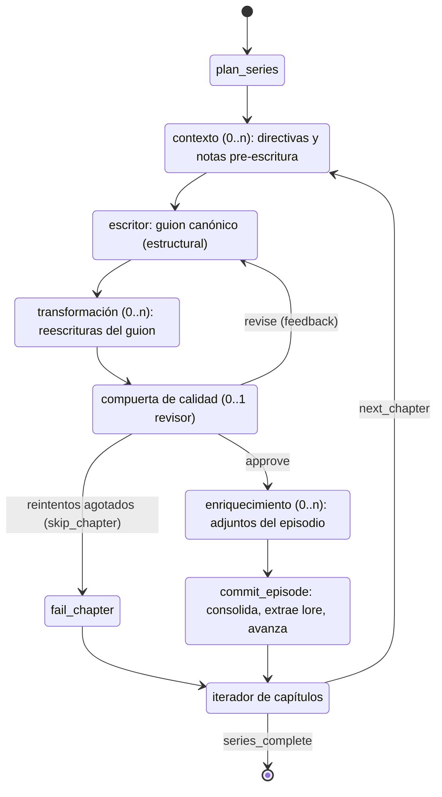

# Sinnema — Arquitectura del sistema

**Motor multi-proyecto que genera series completas de micro-videos verticales mediante un pipeline multi-agente de LLMs.**

Cada *proyecto* (show) concentra su política editorial en un archivo de
configuración — **incluido qué agentes participan de su pipeline, en qué orden
y hasta dónde llega la corrida**. A partir de un tema, el motor **planifica la
serie, emite directivas de continuidad, escribe los guiones, los adapta al
público objetivo, los audita con ciclos de crítica, genera el paquete técnico
de producción y consolida todo** en un entregable JSON listo para render — con
memoria de continuidad persistente entre corridas y una pista de auditoría de
cada ejecución.

- **Stack:** Python ≥ 3.11 · Pydantic v2 · LangGraph · LangChain · FastAPI (servicio web) · React Three Fiber (UI 3D)
- **Proveedores LLM:** Anthropic (Claude), OpenAI (GPT-4o), Google (Gemini) y Ollama local, con fallback entre proveedores
- **Garantía central:** ningún artefacto generado por un LLM circula por el pipeline sin pasar por contratos de dominio validados
- **Agentes dinámicos:** la composición del pipeline es dato, no código — cada show elige sus agentes de un registro declarativo, puede definir agentes nuevos 100% en configuración y cortar la corrida en el hito que necesite

---

## Tabla de contenidos

1. [Qué entra y qué sale](#1-qué-entra-y-qué-sale)
2. [Principio arquitectónico: hexagonal](#2-principio-arquitectónico-hexagonal)
3. [El registro de agentes y la fábrica de nodos](#3-el-registro-de-agentes-y-la-fábrica-de-nodos)
4. [El pipeline multi-agente](#4-el-pipeline-multi-agente)
5. [El estado del grafo](#5-el-estado-del-grafo)
6. [Generación estructurada por rol](#6-generación-estructurada-por-rol)
7. [Proyectos: la unidad de reutilización](#7-proyectos-la-unidad-de-reutilización)
8. [El sobre editorial: tres niveles de límites](#8-el-sobre-editorial-tres-niveles-de-límites)
9. [Validación en profundidad](#9-validación-en-profundidad)
10. [Memoria de continuidad (lore)](#10-memoria-de-continuidad-lore)
11. [Ciclo de calidad y políticas de agotamiento](#11-ciclo-de-calidad-y-políticas-de-agotamiento)
12. [Entregable final](#12-entregable-final)
13. [Auditoría de ejecución](#13-auditoría-de-ejecución)
14. [Proveedores LLM y configuración](#14-proveedores-llm-y-configuración)
15. [Composition root: la CLI](#15-composition-root-la-cli)
16. [Estructura del repositorio](#16-estructura-del-repositorio)
17. [Estrategia de pruebas](#17-estrategia-de-pruebas)
18. [Puntos de extensión](#18-puntos-de-extensión)
19. [Distribución: paquete, servicio web y multi-usuario](#19-distribución-paquete-servicio-web-y-multi-usuario)

---

## 1. Qué entra y qué sale

**Entrada:**

- Un **proyecto** (`proyectos/<id>.toml`): identidad de marca, concepto del
  show, idioma, audiencia, contexto cultural, tono de voz, guía de estilo,
  restricciones, estilo visual maestro, el sobre editorial numérico — y,
  opcionalmente, su **flujo de agentes** (`[flujo]`) y la definición de
  **agentes custom** (`[agentes.<rol>]` con `tipo`).
- Una **petición de serie** (`SeriesRequest`): tema (opcional; si no, el tema
  por defecto del proyecto), número de capítulos, tope de reintentos de
  crítica y — solo en CLI — el alcance de la corrida (`--hasta`).

**Salida:**

- Un **entregable** (`SeriesDeliverable`, `schema_version 1.1`) en JSON: el
  **alcance** alcanzado (`plan` → `guion` → `guion_final` → `auditado` →
  `produccion`), episodios aprobados (cada escena con narración final + prompt
  de imagen + dirección de movimiento, más los **adjuntos** que los
  enriquecedores y agentes custom produjeron), capítulos descartados con su
  motivo, score medio de calidad y glosario de lore de la serie.
- Una **carpeta de auditoría** en texto plano con cada paso de la ejecución,
  incluido el flujo efectivo resuelto.
- El **lore consolidado** del proyecto, persistido para la siguiente corrida.

Todo artefacto intermedio (plan, directivas, borradores, adaptaciones,
dictámenes, paquetes técnicos, notas de agentes custom) es un contrato
Pydantic del dominio.

---

## 2. Principio arquitectónico: hexagonal

El sistema se organiza en tres capas con la regla de dependencias apuntando
siempre hacia dentro:

```
┌──────────────────────────────────────────────────────────────┐
│  infrastructure  ·  adaptadores concretos                    │
│  CLI (composition root) · servicio web (API + jobs + UI) ·   │
│  gateway LLM · carga/escritura TOML · almacén de lore JSON · │
│  pista de auditoría en disco · checkpointer SQLite           │
└──────────────╥───────────────────────────────────────────────┘
               ║  implementa puertos / invoca casos de uso
┌──────────────╨───────────────────────────────────────────────┐
│  application  ·  orquestación y política de producto         │
│  registro de agentes · grafo LangGraph · caso de uso ·       │
│  prompts por rol · ProjectSpec · FlowSpec · SeriesRequest ·  │
│  PUERTOS (Protocol)                                          │
└──────────────╥───────────────────────────────────────────────┘
               ║  dependencia hacia dentro
┌──────────────╨───────────────────────────────────────────────┐
│  domain  ·  núcleo puro, sin I/O ni LLM                      │
│  contratos Pydantic · servicios de dominio · vocabulario de  │
│  alcances · constantes · excepciones                         │
└──────────────────────────────────────────────────────────────┘
```

- **`domain`** no conoce ningún framework: define las entidades de los
  artefactos, los límites universales, el vocabulario cerrado de alcances
  (`ALCANCES`) y la lógica de negocio pura (validaciones de formato,
  coherencia cruzada, gestión de lore).
- **`application`** define los **puertos** que el núcleo necesita del mundo
  exterior — `StructuredGenerationPort`, `LoreStorePort`, `AuditTrailPort`
  (Protocolos Python) — y jamás importa un adaptador concreto. Esto permite
  testear todo el grafo con dobles en memoria. Aquí vive también el
  **registro de agentes** (§3): qué agentes existen, su contrato y su
  semántica en la topología.
- **`infrastructure`** implementa esos puertos: el gateway LLM sobre LangChain,
  el cargador/almacén de proyectos TOML, el almacén de lore en JSON, la pista
  de auditoría en el sistema de archivos y el servicio web (API FastAPI, jobs
  en SQLite, worker y checkpointer).
- La **CLI** es el composition root de la línea de comandos y `create_app` el
  del servicio web: los únicos módulos que arman el mundo (proyecto, entorno,
  adaptadores y caso de uso).

---

## 3. El registro de agentes y la fábrica de nodos

Todo agente del pipeline — sea de código o definido por un proyecto — existe
como una **`AgentDefinition` declarativa** en `application/registry.py`.
Antes, añadir un agente tocaba siete sitios (constante de rol, catálogo de
esquemas, catálogo de prompts, roles configurables, nodo, aristas, spec de
proveedor); hoy el registro consolida todo en un único objeto:

```python
@dataclass(frozen=True)
class AgentDefinition:
    rol: str                  # "scriptwriter", "fact_checker", ...
    tipo: TipoAgente          # cómo se enchufa a la topología (ver abajo)
    esquema: Type[BaseModel]  # contrato que devuelve
    prompts: PromptModule     # build_system_prompt / build_user_message
    mensaje: MensajeBuilder   # adapta los prompts a (project, state) -> str
    nodo: str                 # nombre estable del nodo (checkpointer)
    produce: str              # slot del estado donde escribe
    consume: Tuple[str, ...]  # slots del estado que lee
    validadores: (...)        # validación de dominio post-generación
    al_desactivar: ...        # cortocircuito determinista si el rol está apagado
    esencial: bool            # estructural: no se puede omitir del flujo
    adjunto: bool             # True = el artefacto viaja como adjunto (customs)
```

El **`tipo` fija la semántica del nodo** — la fase del capítulo en la que
trabaja. Es un vocabulario cerrado: el TOML compone eligiendo entre estos
tipos, nunca redefiniendo la topología.

| Tipo | Fase del capítulo | Qué hace | Rol de código |
|---|---|---|---|
| `serie` | nivel de serie (fuera del bucle) | Plan macro de la serie | `planner` |
| `contexto` | pre-escritura | Notas/directivas que informan al escritor | `continuity` |
| `escritor` | escritura | Guion canónico; **destino del feedback** de la compuerta | `scriptwriter` |
| `transformador` | transformación | Consume el guion vigente y produce una versión nueva | `adapter` |
| `revisor` | compuerta | Aprueba o devuelve feedback al escritor | `critic` |
| `enriquecedor` | post-aprobación | Adjunta artefactos al episodio (specs, assets) | `technical_director` |

Invariantes estructurales: **exactamente un `escritor`** y **a lo sumo un
`revisor`** por capítulo (sin compuerta = aprobación directa, episodios sin
score); `planner` es el único agente de nivel de serie. `contexto`,
`transformador` y `enriquecedor` se encadenan en el orden declarado.

Dos mecanismos completan el registro:

- **`AGENT_REGISTRY`** cataloga los seis roles de código con sus nombres de
  nodo históricos (`continuity_master`, `persona_adapter`, `chief_critic`…)
  congelados para no romper los threads del checkpointer. Se auto-valida al
  importar (wiring consistente: slots, esquemas, validadores).
- **`definiciones_del_proyecto(spec)`** = `AGENT_REGISTRY` + los **agentes
  custom del TOML** sintetizados por `definiciones_custom(spec)`: un
  `[agentes.<rol>]` con `tipo` se convierte en una definición equivalente a
  las de código, con un **contrato genérico** (`CONTRATOS_GENERICOS`) como
  esquema y los bloques de `entradas` (catálogo `CATALOGO_ENTRADAS`) como
  mensaje. Es la única fuente del catálogo rol → esquema/prompts/validadores:
  `build_role_system_prompts` ya delega aquí.

**La fábrica de nodos** (`make_agent_node` en `graph.py`) genera el nodo del
grafo a partir de la definición: cortocircuita con el fallback determinista si
el proyecto desactivó el rol → construye el mensaje → pide al puerto de
generación la salida estructurada → **aplica los validadores de dominio ANTES
de que el artefacto circule** → escribe su slot (o adjunta a la pizarra, §5) y
loguea en auditoría. Los **nodos estructurales** — semántica del pipeline, no
de un agente — siguen escritos a mano: `plan_series`, la compuerta de revisión
con su router, `commit_episode`, `fail_chapter` y `consolidar_plan`.

Añadir un agente de código = **1 definición en el registro + 1 módulo de
prompts + 1 contrato de dominio**. Añadir un agente custom = **solo TOML/web**
(§7).

---

## 4. El pipeline multi-agente

La producción de una serie es un **grafo de estado cíclico** (LangGraph)
**compuesto por proyecto**: el builder resuelve el flujo efectivo del show
(§7) y cablea un nodo por agente en cada fase, entre nodos estructurales.

### Topología genérica



Sin sección `[flujo]`, la composición resuelve la topología histórica:
`plan_series → continuity → scriptwriter → adapter → critic →
technical_director → commit_episode` (con los cortocircuitos de
`activo = false` dentro de cada nodo). Con `[flujo]`, cada show elige y ordena
sus agentes por fase. Y con `hasta = "plan"` el grafo ni siquiera abre el
bucle de capítulos: `plan_series → consolidar_plan → END` (outline sin
episodios).

Propiedades de diseño:

- **El grafo se compila por proyecto.** Los nodos nacen de la fábrica (§3)
  cerrando sobre el `ProjectSpec` y el flujo efectivo; cada show produce su
  propio pipeline sin tocar código, y el resultado es auditable: el paso
  `solicitud` de la auditoría registra la cadena efectiva y el hito.
- **Cada nodo de agente es una función pura sobre el estado:** pide al puerto
  de generación la salida estructurada de su rol, la valida contra el perfil
  del proyecto y contra las reglas cruzadas de dominio, y devuelve únicamente
  las claves que modifica.
- **El único ciclo es el de crítica.** Si el revisor rechaza, su feedback
  vuelve al escritor como `pending_feedback`, con un tope de reintentos y una
  política de agotamiento configurable (ver §11).
- **El `commit_episode` es el iterador de lotes:** consolida el episodio con
  sus adjuntos, extrae el lore nuevo, limpia los borradores del capítulo (y la
  pizarra) y avanza el puntero hasta el siguiente capítulo o el fin de serie.
- **Adaptación identidad:** si el flujo corta antes de las transformaciones,
  la compuerta y el enriquecedor operan sobre el borrador con una adaptación
  identidad determinista (sin LLM) — un flujo puede auditar o producir specs
  directamente desde el guion del escritor.
- **El límite de recursión se deriva del flujo efectivo** (§15, fórmula en
  `use_cases.limite_de_recursion`): pasos por capítulo según las fases
  declaradas, más margen por cada reintento de crítica. Nunca se agota en
  silencio por mucho que un show alargue su cadena.

---

## 5. El estado del grafo

Todo el pipeline comparte un único `PipelineState` (un `TypedDict` organizado
en capas):

1. **Input:** parámetros de la corrida (incluido el `alcance` de la misma),
   proyección del proyecto (idioma, tono, tema, audiencia, guía de estilo,
   restricciones).
2. **Plan macro:** el plan de serie aprobado.
3. **Memoria de lore:** lista **append-only** (reducer `operator.add`): los
   nodos nunca sobrescriben la historia acumulada.
4. **Runtime:** puntero de capítulo actual, contador de reintentos, los
   **slots canónicos** del capítulo (directivas, borrador, guion adaptado,
   dictamen, paquete técnico) y la **pizarra** (`artefactos`): un dict
   genérico con reducer de **fusión por clave** donde agentes sin slot
   canónico — enriquecedores y customs de contexto/enriquecimiento — dejan su
   artefacto (`{rol: artefacto}`). Un valor `None` elimina la clave:
   `commit_episode` vacía la pizarra al cerrar cada capítulo.
5. **Output:** episodios aprobados (con sus adjuntos ya embutidos) y
   capítulos fallidos, también append-only.

Los nodos devuelven **actualizaciones parciales** que LangGraph fusiona; los
reducers garantizan que los acumuladores no pierdan historia. El estado
inicial se construye desde la petición validada y se **siembra con el lore
persistido** del proyecto, de modo que la continuidad sobrevive entre corridas.

---

## 6. Generación estructurada por rol

El **registro de agentes** (§3) es la única fuente del catálogo rol →
esquema → prompts → validadores. Sobre eso:

- **El adaptador LLM** (`LangChainStructuredGateway`) vincula cada rol con su
  cliente y su esquema mediante `with_structured_output`, reintenta fallos
  transitorios con backoff y **detecta wiring erróneo**: roles desconocidos,
  roles sin cliente, o peticiones cuyo esquema no coincide con el del rol. El
  gateway acepta un **catálogo de esquemas por proyecto** (`ROLE_SCHEMAS` +
  los contratos de los customs), y `build_gateway` solo da cliente a los
  roles del **flujo efectivo**: un rol fuera del flujo o truncado por el hito
  no exige proveedor ni API key.
- **La aplicación solo conoce el puerto** `StructuredGenerationPort`: recibe
  prompts ya construidos y devuelve una instancia validada del esquema pedido.
- **Los prompts son política de la aplicación**, no de infraestructura: cada
  rol vive en su módulo con el contrato `build_system_prompt(spec)` +
  `build_user_message(...)`; los customs usan `CustomPrompts`, que renderiza
  sus `instrucciones` con placeholders del spec (`{marca}`, `{audiencia}`,
  `{tono}`, …) más los bloques etiquetados de sus `entradas`. Todos inyectan
  la identidad del show y el sobre editorial numérico; el *cómo* (transporte,
  reintentos, proveedor) queda en los adaptadores.

---

## 7. Proyectos: la unidad de reutilización

Un proyecto (show) es un archivo TOML con seis secciones:

| Sección | Contenido |
|---|---|
| `[proyecto]` | id (slug), marca, concepto del show, tema por defecto, idioma |
| `[voz]` | audiencia, contexto cultural, tono, guía de estilo, restricciones |
| `[visual]` | estilo visual maestro (en inglés, para los modelos de imagen) |
| `[formato]` | sobre editorial numérico — **opcional**; sin él rige el perfil por defecto (vertical ~60 s) |
| `[flujo]` | qué agentes participan, en qué orden y **hasta dónde llega** la corrida — **opcional**; sin él rige la topología por defecto |
| `[agentes.<rol>]` | reglas, proveedor/modelo/temperatura, `top_p`/`max_tokens`/`tools`, activación — y, para **agentes custom**, `tipo` + `contrato` + `entradas` + `instrucciones` |

Puntos clave:

- El mapeo TOML → `ProjectSpec` es **puro** (sin I/O): la infraestructura lee
  el archivo; la aplicación decide qué es un proyecto válido.
- La validación de un proyecto **reporta todos los problemas de una vez**,
  no el primero que encuentra.
- El `project_id` es un slug estable que **nombra las carpetas de salida**:
  entregables, auditoría y lore viven separados por proyecto.
- El perfil editorial se valida por coherencia al cargar: los rangos duros
  deben envolver a los objetivos, y todo debe caber en los límites universales.

### Flujo y alcance por proyecto (`[flujo]`)

Sin la sección, todos los shows usan la topología por defecto. Con ella, cada
show elige **qué agentes participan, en qué orden y hasta dónde llega**:

```toml
[flujo]
contexto        = ["continuity", "fact_checker"]  # fase pre-escritura
transformaciones = ["adapter"]                     # tras el escritor
revisor          = "critic"                        # compuerta (opcional)
enriquecimiento  = ["technical_director"]          # post-aprobación
hasta            = "produccion"                    # alcance de la corrida
```

El `hasta` corta la cadena en un hito del vocabulario cerrado
(`plan < guion < guion_final < auditado < produccion`): un show puede entregar
solo el outline (`plan`), los borradores (`guion`), el guion final **sin specs
de video** (`guion_final`), el guion con dictamen (`auditado`) o el paquete
completo con los prompts finales (`produccion`, el default).

- **Flujo efectivo:** `resolver_flujo(project)` devuelve el `FlowSpec`
  truncado en el hito — los agentes declarados por encima del hito no corren
  (el flujo puede declararse completo y compartirse entre shows). Es lo que
  muestran la web, la auditoría y el endpoint `flujo-efectivo`.
- **Coherencia:** `hasta = "auditado"` (o superior) sin `revisor` declarado es
  un error — los capítulos descartados solo pueden surgir de la compuerta.
- **Precedencia del hito:** flag `--hasta` de CLI > `[flujo].hasta` >
  `produccion`. El hito queda **congelado por corrida/job**: editar el TOML
  durante una ejecución no la afecta.
- Con `[flujo]` declarado, **la lista manda**: los roles `activo = false`
  listados son un error accionable ("quítalo del flujo"), y en los no
  listados `activo` se ignora.
- Los agentes `escritor` (`scriptwriter`) y el planificador son estructurales
  y no se listan: siempre participan.
- El **límite de recursión** de la corrida se calcula desde el flujo efectivo
  (§4). El lore solo crece si hay capítulos: un `plan` no toca la memoria.

Validación del flujo (todo se reporta junto al cargar): rol desconocido (con
la lista de disponibles del registro), rol repetido entre fases, rol en una
fase que no corresponde a su `tipo`, esencial listado, `activo = false` en rol
listado, `hasta` fuera del vocabulario o incoherente con la compuerta.

### Agentes custom: agentes nuevos sin tocar código

Cualquier rol nuevo se define íntegramente en el TOML del proyecto —o desde la
web— declarando su `tipo`, su `contrato` genérico de salida, las `entradas`
(bloques del estado que recibe) y sus `instrucciones` (prompt base con
placeholders como `{marca}`):

```toml
[agentes.fact_checker]
tipo          = "contexto"          # contexto | enriquecedor | revisor
contrato      = "notas"             # notas | texto | dictamen (solo revisor)
entradas      = ["capitulo", "lore"]
instrucciones = "Eres el verificador de datos de {marca}. ..."

[flujo]
contexto = ["continuity", "fact_checker"]   # se lista como cualquier rol
```

- **Contratos genéricos** (`domain/models/genericos.py`): `notas`
  (`NotasDelAgente`: `nota_principal` + `puntos_clave`), `texto`
  (`TextoLibre`: `contenido`) — y `dictamen`, que **es directamente el
  `QualityAudit` de dominio**: un revisor custom escribe el slot canónico
  `qa_verdict` y la compuerta depende de esa semántica (revise / approve /
  política de agotamiento), no de un esquema paralelo.
- **Entradas** del catálogo cerrado: `capitulo`, `guion`, `lore`, `plan`,
  `directivas`. Se renderizan como bloques etiquetados en el mensaje de
  usuario, igual que los prompts de código.
- **El registro los trata como primera clase:** `definiciones_custom`
  sintetiza su `AgentDefinition` y la fábrica genera su nodo como cualquier
  otro. Los artefactos de contexto/enriquecimiento viajan por la pizarra y
  quedan **adjuntos al episodio** (`adjuntos`, §12); los proveedores les
  aplican un default LLM genérico (§14) sobreescrible por `[agentes.<rol>]`.
- **Límites honestos:** no hay agentes custom `escritor` ni `transformador`
  (exigen contratos de guion tipados: se quedan en código), sin validación
  cruzada entre agentes (solo el contrato genérico; eso es territorio de los
  agentes de código), `instrucciones` de hasta 2000 caracteres con
  placeholders del catálogo, y rol con forma de slug (`[a-z0-9_]`, máx. 30).
- Validación custom reportada junto al resto: `tipo` y `contrato` del
  vocabulario (un `revisor` exige `dictamen`), instrucciones presentes y en
  rango, placeholders conocidos, `entradas` dentro del catálogo.

---

## 8. El sobre editorial: tres niveles de límites

El sistema controla el formato de los videos con tres niveles cooperantes:

1. **Universales** (`domain.constants`): pisos y techos de sanidad que
   cualquier proyecto debe respetar (p. ej. narrado 30–600 palabras, total
   10–180 s, 1–12 escenas, capítulos ≤ 20). Los aplican los **contratos
   Pydantic** de los artefactos: rechazan basura estructural antes de que
   circule por el pipeline. Aquí vive también el vocabulario de alcances.
2. **Editoriales** (`FormatProfile` del proyecto): rangos concretos por métrica
   — relación de aspecto, palabras narradas (rango objetivo + rango duro),
   cantidad de escenas, duración por escena, duración total, techo de palabras
   por escena, techo de texto en pantalla, score mínimo de aprobación. Los
   aplica el **pipeline tras cada generación** (`domain.services.format`).
3. **Objetivos** (campos `*_target_*`): instruyen los prompts y los **audita
   el revisor**; no invalidan un artefacto por sí solos.

Esta estratificación permite que cada show afine su formato (p. ej. un
formato de 30 s con 4 escenas) sin que un LLM desbordado rompa el sistema.

---

## 9. Validación en profundidad

La defensa contra salidas defectuosas del LLM es por capas:

- **Contratos auto-validados:** cada artefacto recalcula sus propias métricas
  (`word_count`, duración total) y verifica invariantes internas: numeración
  de escenas secuencial desde 1, dificultad de la serie **no decreciente**,
  prerrequisitos que no solapen conceptos propios, dictámenes coherentes (un
  aprobado no puede llevar hallazgos bloqueantes; un rechazo debe estar
  justificado).
- **Coherencia cruzada entre agentes** (`domain.services.assembly`): el plan
  devuelve exactamente los capítulos pedidos; el guion adaptado conserva la
  numeración de escenas del borrador; el paquete técnico cubre exactamente
  esas mismas escenas; todos los artefactos del episodio comparten el
  `chapter_id`. Si dos agentes mezclan artefactos, se detecta en el acto.
- **Sobre editorial** (`domain.services.format`): tras cada generación se
  contrasta el artefacto contra el perfil del proyecto, acumulando todas las
  violaciones en una sola pasada.
- **Prompts de imagen en inglés:** los specs visuales (prompts de imagen,
  negativos, movimiento, miniatura) rechazan caracteres españoles — están
  destinados a modelos de imagen/video, no a personas.

Cualquier fallo de validación lanza un `DomainValidationError` **rápido y
accionable** (qué viola, qué se esperaba) y queda registrado en la auditoría.

---

## 10. Memoria de continuidad (lore)

Cada proyecto persiste un **glosario acumulativo** — el lore — que hace que
las series tengan continuidad entre capítulos *y entre corridas*:

- **Qué es:** términos canónicos (conceptos, personajes, referencias) con su
  definición, el capítulo donde se introdujeron y una categoría.
- **Ciclo de vida:** se **carga** al empezar la corrida (siembra el estado
  inicial), se **amplía** de forma append-only durante la ejecución y se
  **consolida** al terminar, fusionando con deduplicación
  (case-insensitive) contra lo ya almacenado.
- **Extracción determinista:** el lore nuevo se deduce de los conceptos clave
  del capítulo y de los términos nuevos declarados por el agente de
  continuidad — no de texto libre del LLM.
- **Consumo:** el agente de continuidad convierte el glosario en
  `ContinuityDirectives` por capítulo: puente narrativo con el capítulo
  anterior, conceptos ya cubiertos (**prohibido re-explicarlos**), callbacks
  permitidos y términos nuevos (que no pueden solapar con los ya cubiertos).
- **Semántica de fallo:** leer un lore corrupto **aborta en voz alta** (la
  historia es valiosa: no se pierde en silencio); fallar al escribir es
  best-effort y nunca tumba una corrida que ya produjo episodios.

---

## 11. Ciclo de calidad y políticas de agotamiento

El revisor evalúa cada guion (adaptado, o borrador con adaptación identidad si
el flujo no trae transformaciones) sobre dimensiones fijas (ritmo,
presupuesto, adherencia a audiencia, continuidad, claridad, cierre) y emite un
dictamen estructurado: veredicto booleano, score 0–10, estado del presupuesto
de palabras, hallazgos con severidad y corrección sugerida, violaciones de
continuidad y feedback accionable. Un revisor custom emite el mismo contrato
(`dictamen` = `QualityAudit`).

- **Semántica de aprobación reforzada:** un dictamen aprobado exige además el
  score mínimo del proyecto (perfil editorial) y presupuesto de palabras en
  rango; un rechazo exige al menos un hallazgo que lo justifique.
- **Sin revisor no hay ciclo:** un flujo sin `revisor` (o con el crítico
  desactivado) aprueba directo; los episodios salen sin score y el promedio
  reporta 0.0 en vez de un promedio inventado.
- **Bucle de corrección:** el rechazo inyecta el feedback al escritor y el
  capítulo se re-escribe, con un tope de reintentos (1–5, por defecto 2).
- **Política de agotamiento** (`PipelineSettings`):
  - `force_accept` (por defecto): el episodio se consolida marcado con
    `forced_acceptance` — best-effort, visible en auditoría y resumen.
  - `skip_chapter`: el capítulo se descarta y se registra un
    `FailedChapterRecord` con el motivo y el último feedback, y la serie sigue.

El límite de recursión del grafo se calcula a partir del flujo efectivo ×
capítulos × reintentos, de modo que el ciclo de crítica nunca lo agote
silenciosamente.

---

## 12. Entregable final

El `commit_episode` de cada capítulo **ensambla** el episodio aprobado:
consolida las escenas del borrador con la narración vigente encima (adaptada,
o identidad si no hubo transformaciones) y las specs técnicas por escena, y
adjunta los artefactos producidos durante el capítulo: el paquete técnico, el
dictamen y todo lo que los enriquecedores y agentes custom dejaron en la
pizarra (`adjuntos: List[ArtefactoAdjunto]`, cada uno con su `rol` y el
artefacto en JSON).

El entregable de serie (`SeriesDeliverable`, `schema_version` **`1.1`**) se
valida por consistencia global al construirse:

- **`alcance`:** el hito que la corrida alcanzó (`plan` … `produccion`);
  con `plan`, `episodes = []` es válido (outline sin episodios);
- posiciones de episodio secuenciales desde 1, sin huecos ni repeticiones;
- ningún capítulo aprobado y descartado a la vez; el total reportado nunca
  supera lo planificado; **los capítulos descartados exigen un alcance
  `auditado` o superior** (si hay fallos, hubo compuerta);
- el score medio declarado coincide con el promedio recalculado.

Se exporta como JSON (`ensure_ascii=False`, UTF-8) pensado para APIs, motores
de render o persistencia posterior. *Migración 1.0 → 1.1: campos nuevos
`alcance` y `adjuntos`; los consumidores estrictos de 1.0 deben tolerar el
bump.*

---

## 13. Auditoría de ejecución

Cada corrida crea su carpeta (`auditoria/<project_id>/serie_<timestamp>/`)
con:

- `log.txt`: log cronológico con marca de tiempo de todo lo ocurrido;
- `NNN_<paso>.txt`: un archivo por paso completado, con descripción,
  detalles y el **artefacto generado volcado en JSON**. El primer paso,
  `solicitud`, registra el **flujo efectivo** (cadena de roles) y el
  **alcance** de la corrida; cada nodo de agente loguea bajo su rol/nodo
  estable.
- `NNN_<nodo>_prompts.txt`: los prompts (sistema y usuario) que recibió cada
  paso de agente, numerados de modo que quedan **emparejados con su paso** de
  artefacto; la API los re-serve parseados en `/api/jobs/{id}/artifacts`.

La auditoría es un **observador puro**: nunca altera el resultado ni puede
tumbar una ejecución; si el sistema de archivos falla, se desactiva con un
warning y el pipeline continúa.

---

## 14. Proveedores LLM y configuración

Cada rol tiene una asignación por defecto de proveedor/modelo/temperatura,
elegida por el carácter de la tarea:

- **Análisis y control** (planificación, continuidad, crítica): temperaturas
  bajas (0.0–0.2) — Claude para planificar y auditar, GPT-4o-mini para las
  directivas de continuidad.
- **Redacción y adaptación** (guion, registro): GPT-4o y GPT-4o-mini con
  temperaturas altas (0.7–0.8).
- **Traducción visual** (specs técnicas): Gemini (temperatura 0.4).
- **Agentes custom sin asignación:** un default genérico
  (OpenAI / `gpt-4o-mini` / 0.3) con la misma cadena de fallback, sobreescrible
  desde su `[agentes.<rol>]`.
- **Ollama** como refugio local sin credenciales, presente en la cadena de
  fallback de todos los roles.

Mecanismos de configuración:

- **Overrides por rol vía entorno:** `LLM_PROVIDER_<ROL>` y `LLM_MODEL_<ROL>`
  (p. ej. `LLM_PROVIDER_SCRIPTWRITER=ollama`).
- **Precedencia:** proyecto (`[agentes.<rol>]`) > entorno > default. Los
  overrides de generación (`top_p`, `max_tokens`, `tools`) solo vienen del
  proyecto: el entorno cubre únicamente proveedor/modelo.
- **Disponibilidad:** proveedor usable = paquete LangChain instalado +
  credenciales presentes (`ANTHROPIC_API_KEY`, `OPENAI_API_KEY`,
  `GOOGLE_API_KEY`/`GEMINI_API_KEY`; Ollama no requiere clave).
- **Cadena de fallback por rol:** si el proveedor primario no está
  disponible, se cae al siguiente de la lista, avisando por log. Si un rol se
  queda sin proveedor, el arranque aborta con instrucciones accionables —
  salvo que el rol esté **fuera del flujo efectivo**: solo los roles que van
  a correr reciben cliente (§6).
- Carga opcional de `.env` vía `python-dotenv`.

Este módulo es el **único lugar del sistema** que conoce paquetes concretos
de LangChain.

---

## 15. Composition root: la CLI

`main.py` es un punto de entrada delgado; toda la lógica vive en
`infrastructure.cli.main`, el único módulo que arma el mundo completo:

1. parsea argumentos y configura logging;
2. carga y valida el proyecto TOML y aplica el `--hasta` de la corrida
   (validando su coherencia con el flujo: `--hasta auditado` sobre un flujo
   sin revisor aborta con error accionable);
3. construye la petición de serie validada;
4. resuelve el gateway LLM sobre el **flujo efectivo** (proveedores +
   fallbacks, solo los roles que van a correr);
5. instancia auditoría y almacén de lore;
6. compila el caso de uso `GenerateSeriesUseCase` (que a su vez compila el
   grafo del proyecto desde su flujo);
7. **ejecuta con streaming**: imprime el progreso tras cada superstep del grafo;
8. consolida el entregable, persiste el lore, exporta el JSON y escribe el
   resumen final (alcance, episodios, scores, descartados, rutas de salida).

```text
Uso:
  python main.py                                 # proyecto por defecto, 3 capítulos
  python main.py -t "Tema de la serie" -n 5      # tema explícito
  python main.py -p <id> -n 4 -m 3               # proyecto, capítulos, reintentos
  python main.py -p <id> --hasta guion_final     # sobreescribe el alcance por corrida
  python main.py -o ruta/salida.json -v          # salida y logging DEBUG
  python main.py --list-projects                 # cataloga los shows disponibles
```

Artefactos en disco tras una corrida:

```text
salidas/<project_id>/serie_<timestamp>.json   # entregable (1.1, con alcance)
auditoria/<project_id>/serie_<timestamp>/     # pista de auditoría
continuidad/<project_id>/lore.json            # memoria de continuidad
```

El **límite de recursión** de la corrida sale de la fórmula generalizada
(`limite_de_recursion(flujo, capítulos, reintentos)`): pasos mínimos por
capítulo (contextos + escritor + transformaciones + compuerta +
enriquecedores + commit) más un margen por reintento (escritor → … → revisor),
calculado sobre el flujo efectivo del proyecto.

---

## 16. Estructura del repositorio

```text
├── main.py                        # punto de entrada delgado
├── proyectos/                     # un <id>.toml por show (datos, no código)
├── docs/                          # specs: gestión web, agentes dinámicos, red 3D
├── web/                           # UI 3D (React Three Fiber + Vite + TS); build en web/dist
├── scripts/
│   └── ver_grafo.py               # diagrama Mermaid del grafo + stream en vivo
├── sinnema/
│   ├── domain/                    # núcleo puro (sin I/O ni LLM)
│   │   ├── constants.py           #   límites universales + vocabulario de alcances
│   │   ├── exceptions.py          #   DomainValidationError
│   │   ├── text.py                #   utilidades de conteo/detección de texto
│   │   ├── models/                #   contratos Pydantic de cada artefacto
│   │   │   ├── planning.py        #     SeriesPlan, ChapterOutline
│   │   │   ├── continuity.py      #     ContinuityDirectives, LoreEntry
│   │   │   ├── content.py         #     ScriptDraft, AdaptedScript, escenas
│   │   │   ├── audit.py           #     QualityAudit, hallazgos
│   │   │   ├── technical.py       #     TechnicalPackage, specs visuales/audio
│   │   │   ├── genericos.py       #     NotasDelAgente, TextoLibre (agentes custom)
│   │   │   ├── deliverable.py     #     ApprovedEpisode (+adjuntos), SeriesDeliverable 1.1
│   │   │   └── project.py         #     FormatProfile (sobre editorial)
│   │   └── services/              #   lógica pura: format, assembly (identity_adaptation), lore
│   ├── application/               # orquestación y política de producto
│   │   ├── registry.py            #   AGENT_REGISTRY + definiciones custom + contratos genéricos
│   │   ├── graph.py               #   make_agent_node + build_pipeline_graph (compone por flujo)
│   │   ├── state.py               #   PipelineState (slots canónicos + pizarra + reducers)
│   │   ├── ports.py               #   puertos, roles y ROLE_SCHEMAS
│   │   ├── use_cases.py           #   GenerateSeriesUseCase, build_deliverable, límite de recursión
│   │   ├── projects.py            #   ProjectSpec, AgentConfig, FlowSpec, resolver_flujo
│   │   ├── requests.py            #   SeriesRequest + estado inicial
│   │   ├── settings.py            #   PipelineSettings (ciclo de crítica)
│   │   ├── tools.py               #   vocabulario de tools integradas (buscar_lore, leer_formato)
│   │   └── prompts/               #   system/user prompts por rol (+ CustomPrompts)
│   └── infrastructure/            # adaptadores concretos
│       ├── cli/main.py            #   CLI + composition root
│       ├── llm/                   #   gateway LangChain + proveedores + tools integradas
│       ├── projects/              #   descubrimiento, carga y escritura de TOML
│       ├── lore/store.py          #   JsonLoreStore (LoreStorePort)
│       ├── audit/filesystem.py    #   FilesystemAuditTrail (AuditTrailPort)
│       ├── api/                   #   servicio web FastAPI (sirve el build de web/), visor HTML
│       └── runtime/               #   jobs SQLite + SeriesWorker + checkpointer
└── tests/                         # una suite por capa, sin red
```

---

## 17. Estrategia de pruebas

La suite (≈425 tests backend + 27 vitest frontend, en CI) cubre cada capa de forma aislada y sin red:

- **Contratos de dominio:** cada modelo con sus invariantes y casos límite,
  incluido el entregable 1.1 (coherencia alcance ↔ fallos, adjuntos).
- **Servicios puros:** validación de formato, coherencia cruzada de
  ensamblaje (con adaptación identidad), extracción y fusión de lore.
- **Aplicación:** petición/ajustes, prompts parametrizados por proyecto,
  **registro de agentes** (catálogo, tipos, wiring, definiciones custom),
  **resolución de flujo** (matriz de `[flujo]` válidos/inválidos, truncado por
  `hasta`, semántica legacy), **agentes custom** (cada tipo permitido y sus
  errores de validación), caso de uso y **el grafo completo** con un gateway
  falso en memoria — topología efectiva por configuración y corridas por cada
  hito (`plan` sin episodios, `guion` con identidad, `produccion` completo,
  revisor ausente).
- **Infraestructura:** gateway (wiring, reintentos, catálogo por proyecto),
  resolución de proveedores (incluido el default de customs), almacén de
  lore, pista de auditoría, cargador/almacén de proyectos, jobs/worker,
  API (CRUD con flujo, `flujo-efectivo`, `meta/roles`), visor, CLI de punta a
  punta con puertos nulos y el script `ver_grafo`.
- **Frontend (`web/`):** parsers SSE (cortes de paquete, CRLF, formato
  legacy), layout y dispose de la escena 3D, `executionStore` (suscripciones
  transitorias) y validaciones de formularios extraídas a funciones puras.

Un workflow de GitHub Actions (`.github/workflows/ci.yml`) corre en cada PR
la suite backend (`pytest`) y el frontend (`eslint` + `vitest` + `build`).

La regla de dependencias hexagonal es lo que hace esto posible: el núcleo se
testea con dobles porque solo conoce puertos.

---

## 18. Puntos de extensión

| Quiero… | Cómo |
|---|---|
| Crear un show nuevo | Añadir un `<id>.toml` en `proyectos/` (o desde la web) — sin tocar código |
| Cambiar el formato de un show | Ajustar su sección `[formato]` (o quitarla para el perfil por defecto) |
| Añadir un agente sin código | `[agentes.<rol>]` con `tipo`/`contrato`/`entradas`/`instrucciones` (TOML o web) + listarlo en `[flujo]` |
| Añadir un rol de agente de código | Una `AgentDefinition` en `registry.py` + módulo de prompts + contrato de dominio |
| Cambiar qué agentes usa un show | Su sección `[flujo]` (fases + `hasta`); verificar el resultado con el flujo efectivo |
| Añadir un proveedor LLM | Extender `infrastructure/llm/providers.py` (import con guarda, disponibilidad y builder) |
| Otro almacenamiento de lore/auditoría (BD, S3…) | Implementar `LoreStorePort` / `AuditTrailPort` — la aplicación no cambia |
| Otra interfaz (API, web, cola) | Reutilizar `GenerateSeriesUseCase` y `build_deliverable`; la CLI y el servicio web son solo clientes más |
| Ver el grafo de un show | `scripts/ver_grafo.py` (Mermaid/stream) o `GET /api/projects/{id}/flujo-efectivo` |
| Otra política de calidad | `PipelineSettings`: reintentos (1–5) y política de agotamiento (`force_accept` / `skip_chapter`) |

---

## 19. Distribución: paquete, servicio web y multi-usuario

El motor se distribuye de dos formas sobre el mismo núcleo hexagonal.

### Instalación como paquete

```bash
pip install sinnema            # o: pip install "sinnema[server]" para el servicio web
sinnema --list-projects        # CLI completo, con los shows de ejemplo incluidos
sinnema -p motores -t "Motores híbridos" -n 4
```

El paquete viaja con los proyectos de ejemplo; en despliegues se apunta a un
directorio propio con `SINNEMA_PROJECTS_DIR=/ruta/a/proyectos`. Los shows en
desarrollo se leen desde `proyectos/` en la raíz del repo (resolución en
cascada: variable de entorno → repo → paquete).

### Servicio web (API + UI)

```bash
pip install "sinnema[server]"
sinnema-server                 # http://127.0.0.1:8000
```

#### UI 3D: monitor de la red de agentes (`web/`)

El frontend 3D (`web/`: React Three Fiber + Vite + TypeScript + Tailwind,
spec `docs/spec-red-3d.md`, implementado) es la UI del servicio **y a la vez
la web de gestión de proyectos y agentes**: `GET /` sirve el build `web/dist`
y, sin build JS, una página que indica cómo generarlo (la web legacy de
`static/` fue reemplazada al completar la lista de paridad §12.3 de la
spec).

```bash
cd web
npm install
npm run dev        # desarrollo: :5173 con proxy /api → :8000 (con sinnema-server al lado)
npm run build      # producción: genera web/dist (no se commitea)
npm run test       # vitest
npm run lint       # eslint
```

Sin build JS la API sigue completa (`/docs`), y la wheel no empaqueta
`web/`. El recorrido de verificación de punta a punta está documentado en
[`docs/e2e-red-3d.md`](docs/e2e-red-3d.md).

Sobre la escena 3D —nodos por agente y estructurales, aristas con flechas y
condicionales, pulsos dirigidos por eventos y flujo ambiental, cámara con
lerp— conviven cuatro superficies de gestión:

- **Barra superior:** cambio de proyecto (switcher) y contexto de la red
  activa.
- **Drawer de proyectos:** CRUD completo (crear, editar, duplicar, eliminar),
  **alta y baja de agentes custom**, lore (ver/reiniciar), vista previa de
  los prompts compuestos y enlaces al visor de series.
- **Inspector** (click en un nodo del grafo): pestaña **Agente** (formulario
  LLM del rol — reglas, proveedor/modelo/temperatura, `top_p`/`max_tokens`/
  `tools` — con validaciones espejo del backend que guardan el TOML completo
  y avisan que aplica a la próxima corrida), pestaña **Estado** (inspección
  en vivo del job activo: artefactos y prompts por paso, scratchpad de
  tools, stream de tokens del nodo y diff de claves que actualizó cada
  `node_end`) y pestaña **Flujo** (editor de `[flujo]` por fases con
  selector de alcance y validaciones espejo).
- **Panel de ejecución:** lanzar la corrida del proyecto activo, elegir qué
  job seguir y timeline 2D del progreso en vivo vía SSE
  (`node_start`/`node_end`, tokens, `tool_start`/`tool_end`), con aviso de
  **spec desfasado** si el proyecto cambió durante la corrida.

La API:

| Endpoint | Qué hace |
|---|---|
| `GET /api/health` | Estado del servicio y del worker |
| `GET /api/projects` | Shows disponibles (con `editable`) |
| `GET /api/projects/{id}` | Definición cruda del proyecto (forma del TOML, incluye `[flujo]`) |
| `POST /api/projects` | Crea un proyecto (valida todo junto — flujo, alcance y customs incluidos; 400 con problemas) |
| `PUT /api/projects/{id}` | Sobreescribe un proyecto (id inmutable) |
| `DELETE /api/projects/{id}` | Borra el archivo (409 si hay jobs activos) |
| `GET /api/projects/{id}/prompts` | Vista previa de los prompts del sistema compuestos |
| `GET /api/projects/{id}/flujo-efectivo` | Fases resueltas, hito, agentes custom, límite de recursión y diagrama Mermaid |
| `GET /api/projects/{id}/red` | **Red efectiva como recurso** (monitor 3D): nodos y aristas derivados del grafo compilado, anotados con el registro y el `LLMConfig` resuelto por rol |
| `GET/DELETE /api/projects/{id}/lore` | Ver / reiniciar la memoria de continuidad |
| `GET /api/meta/roles` | Catálogo de agentes **desde el registro** (tipo, descripción, esencial, desactivable, defaults LLM) |
| `GET /api/meta/catalogos` | Catálogos para formularios: proveedores, modelos sugeridos, tools integradas, hitos, tipos/contratos/entradas custom |
| `POST /api/series` | Crea un job de generación (202, devuelve `job_id`) |
| `GET /api/jobs` | Jobs del usuario (header `X-Owner`, filtro `?project_id=`) |
| `GET /api/jobs/{id}` | Estado, error o entregable del job |
| `GET /api/jobs/{id}/events` | Progreso en vivo (Server-Sent Events) |
| `GET /api/jobs/{id}/events/history` | Historial de eventos ya emitidos (`?since=` para retomar donde quedó el stream) |
| `GET /api/jobs/{id}/artifacts` | Pasos del job parseados de la auditoría: resumen, artefacto JSON y prompts (`/artifacts/{n}` devuelve un paso) |
| `GET /api/jobs/{id}/deliverable` | JSON del `SeriesDeliverable` |
| `GET /api/jobs/{id}/viewer` | Visor HTML de la serie — con badge de **alcance** y **adjuntos** por episodio como acordeones JSON |

Variables de entorno del servicio: `SINNEMA_DATA_DIR` (raíz de jobs,
checkpoints, auditoría, lore y salidas; por defecto `datos-servidor/`),
`SINNEMA_HOST` y `SINNEMA_PORT`.

### Gestión web de proyectos: los archivos son la fuente de verdad

La web de gestión edita los mismos `proyectos/<id>.toml` que lee el pipeline
(escritura atómica con `tomli-w`). Cada job carga el spec vigente desde disco
al arrancar: cambiar un proyecto —su flujo, su alcance o sus agentes custom—
aplica a la próxima corrida, sin reiniciar. Las specs completas están en
[`docs/spec-gestion-web.md`](docs/spec-gestion-web.md),
[`docs/spec-agentes-dinamicos.md`](docs/spec-agentes-dinamicos.md) y
[`docs/spec-red-3d.md`](docs/spec-red-3d.md) (monitor 3D de la red de
agentes, implementado); lo esencial del esquema:

```toml
[agentes.scriptwriter]          # planner, continuity, scriptwriter, adapter,
reglas = ["Cerrar con dato verificable"]   # critic, technical_director
temperatura = 0.9               # opcional (0.0-2.0)
# proveedor / modelo            # opcional: override por rol
top_p = 0.95                    # opcional (0.0-1.0): ausente = default del proveedor
max_tokens = 4096               # opcional (> 0): ausente = default del proveedor
# tools = ["buscar_lore"]       # opcional: tools integradas del rol (spec-red-3d §7.3)

[agentes.adapter]
activo = false                  # desactiva el agente (planner y scriptwriter no)

[pipeline]
# intentos_maximos_de_critica = 3          # default cuando la corrida no lo fija
# politica_al_agotar = "aceptar_forzado"   # o "saltar_capitulo"
```

- **Reglas**: se apendan al prompt del sistema del rol (bloque
  `REGLAS ADICIONALES DEL PROYECTO`).
- **Proveedor/modelo/temperatura**: precedencia **proyecto > entorno > default**;
  los roles desactivados no necesitan proveedor ni clave.
- **top_p/max_tokens**: overrides de generación opcionales; ausentes no se
  pasan al constructor (rige el default del proveedor). Cada paquete recibe su
  nombre nativo (`ChatOllama` usa `num_predict`, Google `max_output_tokens`).
- **tools**: habilita tools integradas para el rol (`buscar_lore`,
  `leer_formato`); los nombres se validan contra el catálogo
  (`GET /api/meta/catalogos`). En ejecución, el gateway corre un loop
  `bind_tools` con guard de iteraciones y emite eventos
  `tool_start`/`tool_end`; el materializador vive en
  `infrastructure/llm/tools.py` (@tool LangChain sobre los puertos).
- **Desactivar un rol** cortocircuita su nodo con el fallback determinista de
  su definición (sin llamar al LLM): `continuity` avanza sin directivas (el
  lore sigue creciendo desde los conceptos clave), `adapter` pasa el borrador
  tal cual (adaptación identidad), `critic` aprueba sin dictamen (episodios
  sin score) y `technical_director` entrega sin specs visuales. `planner` y
  `scriptwriter` son estructurales y no se desactivan. Con `[flujo]`
  declarado, la lista manda y `activo` en roles listados es un error.
- El directorio escribible se resuelve `SINNEMA_PROJECTS_DIR` → `proyectos/`
  del repo → `<SINNEMA_DATA_DIR>/proyectos`; el listado fusiona con los shows
  empaquetados (editar uno de muestra escribe una copia local que gana por id).

### Modelo de ejecución y escalado

- Los jobs viven en SQLite (`SqliteJobStore`), con aislamiento básico por
  propietario (`X-Owner`); la autenticación real queda en la capa de
  despliegue (reverse proxy + TLS + rate limiting).
- Un worker en proceso (cola + hilo) ejecuta cada serie; el gateway LLM se
  construye **por job** sobre el flujo efectivo del spec vigente (así una
  edición del TOML aplica a la próxima corrida).
- Cada corrida usa un **checkpointer SQLite de LangGraph** (un archivo por
  job en `SINNEMA_DATA_DIR/checkpoints/`): el estado del grafo persiste tras
  cada superstep y la corrida es reanudable. Los nombres de nodo son
  estables (los históricos se congelaron en el registro), y cada job congela
  flujo+alcance al arrancar: reanudar un thread tras cambiar el flujo del
  proyecto queda fuera de garantía.
- Cada job emite **eventos de ejecución** (`node_start`/`node_end`,
  tokens en streaming, `tool_start`/`tool_end`) a través de un `on_event`
  opcional del puerto de generación; el gateway hace `stream` con fallback a
  `invoke` y los eventos se persisten en SQLite (`job_events`), de donde el
  SSE y el endpoint de historial (`?since=`) los sirven a la UI.
- Para escalar horizontalmente se reemplaza la cola por un broker
  (Celery/RQ/SQS) y el hilo por workers separados: `SeriesWorker` ya aísla
  store, gateway, auditoría, lore y checkpointer, y el núcleo no cambia.
- Para multi-tenancy fuerte basta implementar `LoreStorePort` y
  `AuditTrailPort` sobre una base de datos u object storage por usuario.

### Empaquetado

`pyproject.toml` (Hatchling) declara el paquete `sinnema`, los extras
`[server]` y `[dev]`, los entry points `sinnema` y `sinnema-server`, y
incluye `proyectos/*.toml` dentro de la wheel. Build: `python -m build`.

## Licencia

Este proyecto está bajo la Licencia MIT. Consulta el archivo [LICENSE](LICENSE) para más detalles.
