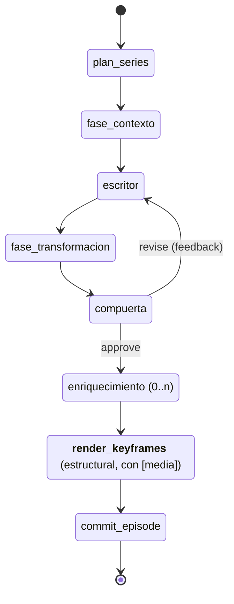

# Spec — Recursos ancla: consistencia visual de personajes, lugares y contexto

Estado: **v1 (propuesta)** · Fecha: 2026-09-12 · Complementa: `spec-agentes-dinamicos.md`, `spec-gestion-web.md` y `spec-red-3d.md` (los extiende, no los reemplaza)

## 1. Objetivo

Que la generación de media del pipeline se apoye en **recursos ancla**: una
biblioteca por proyecto de personajes, lugares, objetos y estilo con **baterías
de imágenes de referencia** y **descriptores canónicos**, de modo que:

1. Un personaje sea **"el mismo" en todo el transcurso de un video** (entre
   escenas de un capítulo).
2. Ese mismo personaje **no parezca otra persona en videos posteriores**
   (entre capítulos y entre corridas).
3. Lo mismo aplique a **lugares y contexto visual** (el mundo de la serie).
4. Las baterías de recursos **se retroalimenten**: el media aprobado de un
   video alimenta la biblioteca que usan los futuros.
5. El **agente de continuidad** sea el garante del proceso: hoy custodia la
   continuidad narrativa; pasa a custodiar también la **continuidad visual**.

El alcance del cambio es una **capa nueva** sobre el circuito completo —
contratos de dominio, almacén, agentes, prompts, validadores, generación de
media, QA y capa gráfica web— no un ajuste de prompts.

**Principios rectores** (heredados del sistema):

- **Los archivos son la fuente de verdad**: la biblioteca de anclas vive en
  disco (JSON + archivos de media), por proyecto, como los TOML, el lore y la
  auditoría; sobrevive a `docker compose down` y se puede versionar con git.
- **Ningún artefacto sin contrato validado**: cada ancla, cada referencia a
  ancla en una spec visual y cada manifest de generación es un contrato
  Pydantic de dominio validado antes de circular.
- **Compatibilidad estricta**: un proyecto sin anclas y sin `[media]` produce
  hoy exactamente lo mismo que ayer (test de paridad por fase).
- **Hexagonal**: la aplicación conoce **puertos** (`AnchorStorePort`,
  `MediaGenerationPort`); los proveedores concretos (OpenAI, Gemini, Veo,
  ComfyUI…) son adaptadores de infraestructura.
- **El lock es humano**: solo anclas aprobadas por una persona ("lockeadas")
  participan del pipeline. El feedback automático **propone**, nunca
  reemplaza.

## 2. Diagnóstico: la consistencia visual hoy es 100% prompt-level

Análisis del código (ramas `main`, sep 2026). La identidad visual del sistema
descansa exclusivamente en texto inyectado a los LLM:

| Mecanismo actual | Dónde | Límite |
|---|---|---|
| `estilo_maestro` del proyecto | `[visual]` del TOML (`proyectos/*.toml:21`) → `ProjectSpec.visual_master_style` | Texto libre único para todo el show; sin estructura por entidad |
| Regla del director ("mismos personajes, misma paleta, mismo mundo") | `application/prompts/director.py:46` | Es **la única defensa** de consistencia de personajes; no hay datos que sostener |
| "repitiendo sus descriptores canónicos" | `application/prompts/director.py:25` | No existen descriptores canónicos estructurados: cada corrida re-inventa los suyos |
| `recurring_elements` del plan | `domain/models/planning.py` (≤10 strings narrativos) | Identidad serial narrativa (mascota, apertura), no ficha visual por entidad |
| `LoreEntry.category = "personaje"` | `domain/models/continuity.py:18` | La categoría **existe en el vocabulario pero nunca se produce** (`services/lore.py` solo extrae `concepto` y `termino`); sin descriptor visual |
| `VisualAssetSpec` por escena | `domain/models/technical.py:26-65` | `image_prompt` + `negative_prompt` + `composition` + `motion_direction` + `style_tags`. No hay ids de entidades, ni seeds, ni referencias, ni trazabilidad |
| Estado y adjuntos | `PipelineState` + pizarra (`artefactos`) + `adjuntos` | ✅ Listo para transportar artefactos nuevos sin tocar slots canónicos |
| Web | `web/src` (drawer, inspector, 3D) | **Cero** manejo de imágenes: no muestra media, no gestiona assets |

**Conclusión:** cada escena re-describe a los personajes desde cero dentro de
un `image_prompt` libre; nada persiste el rostro de un personaje entre
escenas, capítulos o corridas; no existe semilla, referencia ni manifest. La
deriva visual entre escenas —y sobre todo entre videos— es el comportamiento
esperado del diseño actual, no un bug puntual. Y el pipeline termina en
prompts: no hay capa de generación de media ni QA sobre lo generado.

## 3. Qué se acostumbra en la industria (insumos de diseño)

Relevamiento (sep 2026) de las prácticas estándar del sector para consistencia
de personajes/escenas en pipelines de media generativo.

### 3.1 Referencias nativas por proveedor

Los proveedores convergen en el mismo mecanismo: **condicionar la generación
con 1–5 imágenes de referencia** mantenidas en memoria por el modelo.

| Proveedor / feature | Referencias | Notas operativas |
|---|---|---|
| OpenAI `gpt-image-1` (`/images/edits`) | `image[]` multi-referencia (~16) | `input_fidelity="high"` preserva rasgos con máxima fidelidad **solo en la primera imagen** del array → el ancla de identidad debe ir primera |
| Gemini image ("Nano Banana" 2 / Pro) | ≤4 consistencia de personaje (Pro: ≤5) + ≤3 de estilo | Categorías de referencia dedicadas (character consistency / style) |
| Veo 3.1 (`referenceImages`, "ingredients") | ≤3 | Preserva apariencia del sujeto; duración fija de 8 s con referencias; `image` (primer frame) y `lastFrame` disponibles en todas las variantes |
| Runway Gen-4 References | ≤3 | Personaje/objeto/localización desde una sola imagen, sin fine-tuning; Act-Two añade performance transfer |
| Kling Elements | 1–4 | Interacción multi-sujeto en video; start/end frames para transiciones |
| Midjourney V7 | `--oref` ×1 (peso `--ow`) | `--sref` separa el ancla de **estilo** del ancla de **identidad** |

Implicación directa: la batería de un personaje debe ser un **superset** (varias
imágenes por rol) y un **resolver por proveedor** elige cuáles enviar y **en
qué orden**, respetando el máximo de cada API.

### 3.2 Character sheets / location sheets (la "batería")

La unidad estándar de trabajo no es "una imagen de referencia" sino una
**batería por entidad**, generada y aprobada **antes** de producir shots:

- **Personaje:** 1–3 *hero portraits* (casting → lock) + **turnaround** de
  cuerpo completo (front / ¾ / side / back) + **expression sheet** (4–9
  expresiones) + variantes por **vestuario** cuando cambia entre escenas.
- **Lugar:** 2–3 stills de entorno (*establishing* + ángulos de cobertura) +
  *lighting bible* (dirección de key light, temperatura de color, contraste) +
  descripción canónica de texto reutilizada en cada prompt.
- **Estilo global:** 1 style reference (o style LoRA / `--sref` / style refs
  de Nano Banana Pro).

### 3.3 LoRA por entidad (autoalojado)

Para protagonistas de larga vida, el ecosistema abierto (Flux/SDXL + ComfyUI)
entrena **LoRA por personaje**: 20–30 imágenes variadas, trigger word único,
peso resultante 40–150 MB. Criterio emergente: **LoRA** para personajes
protagonistas recurrentes con necesidad de máxima fidelidad; **referencias /
adapters** (IP-Adapter, InstantID, PuLID, Flux Kontext) para secundarios y
prototipado. En la práctica los pipelines serios combinan
adapter + ControlNet (pose) + QA. Queda como fase opcional (§13, Fase 6).

### 3.4 Patrón de pipeline: story bible → asset library → shots → QA

El patrón profesional recurrente (estudios de AI filmmaking, productos tipo
Runway Workflows y LTX Studio "Elements/Cast", y la evidencia académica de
*"Lights, Camera, Consistency"*, arXiv 2512.16954):

1. **Bible** (premisa, tono, estilo global) →
2. **Asset library con IDs** (character/place bible: baterías lockeadas) →
3. **Shot prompts que referencian asset IDs** (nunca descripciones libres
   divergentes) →
4. **Keyframe por shot**: generar primero el fotograma exacto con un modelo de
   imagen (con referencias de personaje+lugar) y recién entonces animar
   image-to-video — es más fácil forzar consistencia en imagen que en video →
5. **I2V** con encadenado *last-frame → first-frame* ("temporal bridge": el
   último frame del shot N condiciona el shot N+1) →
6. **QA + gate humano** → 7. Edición/color.

Hallazgo clave del paper: el **keyframe ancla es el elemento arquitectónico
crítico** — sin él la consistencia de personaje colapsa (7,99 → 0,55 en su
escala MLLM-judge); sin imágenes de personaje, 7,99 → 5,78.

### 3.5 QA de identidad

- **Caras:** similitud coseno con ArcFace/InsightFace; umbral típico
  "misma identidad" **~0,35–0,45** (calibrar con datos propios; para caras
  generadas rara vez se supera 0,6).
- **Escena / personaje sin cara:** embeddings **DINOv2** con máscara de fondo;
  **CLIP** para adherencia prompt-imagen (coseno crudo ~0,20–0,26).
- **Dedup:** pHash (distancia de Hamming ≤10 en 64 bits) de primer nivel.
- **MLLM-as-a-judge** (score 0–10) como capa opcional de veredicto global.

### 3.6 Procedencia y reproducibilidad

El `seed` de los proveedores **no garantiza determinismo** (doc oficial de
Veo) y las versiones de modelos cerrados rompen reproducibilidad; el estándar
de facto es un **manifest propio por media generado**: prompt final, modelo y
versión exacta, seed, IDs y **orden** de las referencias usadas, parámetros
(pesos de referencia, fidelidad), id externo y timestamp. C2PA es el estándar
de procedencia pública cuando el proveedor lo emite; para uso interno basta el
manifest propio.

### 3.7 Implicaciones de diseño

1. Biblioteca de anclas por proyecto con **IDs estables**, baterías por rol y
   **lock humano**.
2. Los prompts de shot **referencian anclas por ID** + descriptor canónico;
   el descriptor libre queda prohibido para entidades ancladas.
3. **Keyframe-first**: imagen ancla por escena antes que video.
4. **Resolver por proveedor** que adapta la batería a los límites/orden de
   cada API.
5. **QA por embeddings** contra la batería, con umbral configurable y bucle de
   regeneración acotado.
6. **Manifest por media** (procedencia interna) + promoción **con lock
   humano** de media aprobado a la batería.

## 4. Diseño: la biblioteca de recursos ancla

### 4.1 Contratos de dominio (`domain/models/anclas.py`, nuevo)

```python
TipoDeAncla = Literal["personaje", "lugar", "objeto", "estilo"]

RolDeImagen = Literal[
    "hero_portrait", "turnaround_front", "turnaround_quarter",
    "turnaround_side", "turnaround_back", "expression_sheet",
    "outfit_variant",                      # personaje
    "establishing_shot", "coverage_angle", "lighting_reference",  # lugar
    "prop_hero", "prop_detail",            # objeto
    "style_reference",                     # estilo
]

class ImagenAncla(BaseModel):
    rol: RolDeImagen
    archivo: str            # ruta relativa bajo anclas/<project_id>/<ancla_id>/
    origen: Literal["subida", "generada"] = "subida"
    manifest: Optional[ManifestDeGeneracion] = None   # si origen = generada

class RecursoAncla(BaseModel):
    ancla_id: str           # slug estable, único por proyecto
    tipo: TipoDeAncla
    nombre: str             # único case-insensitive por proyecto
    descripcion_canonica: str   # EN INGLÉS, min 40 chars (misma regla que estilo_maestro)
    estado: Literal["borrador", "propuesto", "lockeado", "retirado"] = "borrador"
    bateria: List[ImagenAncla] = []
    version: int = 1        # bump al modificar la batería de una ancla lockeada
    chapter_first_seen: Optional[str] = None
    chapter_last_seen: Optional[str] = None
```

Reglas (validación en profundidad, §11):

- El `rol` de cada imagen debe ser coherente con el `tipo` de la ancla.
- Solo anclas **`lockeadas`** (y no `retiradas`) participan del pipeline.
- **Lock exige batería mínima**: personaje ≥1 `hero_portrait` + turnarounds
  (mín. front/side/back); lugar ≥1 `establishing_shot`; objeto ≥1
  `prop_hero`; estilo ≥1 `style_reference`. Batería recomendada = §3.2.
- `descripcion_canonica` en inglés puro (rechazo de español igual que los
  prompts visuales): es texto destinado a modelos de imagen.
- El lock es **irreversible por edición silenciosa**: cambiar la batería de
  una ancla lockeada sube `version`; lo ya generado conserva el manifest con
  la versión usada. Retirar **no borra** (los episodios pasados la citan).

### 4.2 Almacenamiento: archivos como fuente de verdad

Espejo exacto del lore (`JsonLoreStore`):

- `anclas/<project_id>/anclas.json` — lista de `RecursoAncla` (UTF-8,
  `ensure_ascii=False`).
- `anclas/<project_id>/<ancla_id>/<rol>_<n>.<ext>` — archivos de media.
- Puerto `AnchorStorePort` en `application/ports.py`
  (`load(project_id) / save(project_id, anclas)`); implementación
  `JsonAnchorStore` en `infrastructure/anclas/store.py`.
- **Semántica de fallo igual a la del lore**: lectura corrupta aborta en voz
  alta (la biblioteca es valiosa, no se pierde en silencio); la escritura
  nace de acciones humanas de la UI/API, así que un fallo es un error
  accionable, no best-effort.
- En el servicio web vive bajo `SINNEMA_DATA_DIR` (como jobs, checkpoints,
  auditoría y lore): `datos-servidor/anclas/` ya montado como volumen en
  Docker Compose.

### 4.3 Configuración por proyecto

La participación de anclas es **automática si hay anclas lockeadas** (sin
sección nueva obligatoria), con opt-out y afinación en `[visual]`:

```toml
[visual]
estilo_maestro = "Clean 3D isometric fintech world, ..."   # igual que hoy
# anclas = false          # opt-out: ignora la biblioteca (default true)
# ancla_estilo = "look-principal"   # ancla de estilo aplicada a todo render
```

Y en la fase de media (§6), una sección nueva **opcional**:

```toml
[media]
keyframes = true          # keyframe por escena (imagen ancla)
video = false             # I2V por escena (fase posterior, coste alto)
encadenar_frames = true   # last-frame → first-frame entre escenas contiguas
proveedor_imagen = "gemini"   # o "openai" (default del entorno)
intentos_qa = 1           # regeneraciones ante QA fallido (0 = sin QA-loop)
```

Los umbrales de QA y las claves de proveedores van por entorno (mismo patrón
`LLM_*`: `MEDIA_PROVIDER_<ROL>`-style o claves existentes de cada SDK), no al
TOML.

### 4.4 Relación con el lore

- `LoreEntry` gana un campo opcional `ancla_id: Optional[str]`: una entrada de
  categoría `personaje` puede quedar ligada a su ancla visual.
- La extracción de lore (`services/lore.py`) empieza a producir categoría
  `personaje` cuando un término nuevo coincide con el nombre de una ancla
  activa del capítulo (cruce determinista, no LLM).
- Inverso (Fase 5): un `personaje` de lore **sin ancla** recurrente genera una
  **propuesta de casting** (ancla `propuesta`) — el gate humano decide.

## 5. El pipeline con anclas: la continuidad como garante

Topología con la capa nueva (nodos estructurales en negrita; `render_keyframes`
es nuevo y **solo se inserta si `[media].keyframes = true`**):



### 5.1 Continuidad narrativa + visual (el rol `continuity`)

El agente de continuidad es el **garante** de que las mismas entidades
narrativas y visuales atraviesan la serie. La memoria que siembra la corrida
pasa a incluir la **biblioteca de anclas lockeadas** del proyecto (nuevo slot
de estado `anclas`, solo-lectura durante la corrida, igual semántica que la
siembra del lore).

- **`ContinuityDirectives`** se extiende con un campo con default vacío
  (compatible con contratos y tests existentes):

  ```python
  class AnclaDelCapitulo(BaseModel):
      ancla_id: str
      tipo: TipoDeAncla
      descriptor: str        # copia EN del canónico (trazabilidad del prompt)
      instrucciones: str     # ES: rol en el capítulo (vestuario, estado, tratamiento)

  # dentro de ContinuityDirectives:
  anclas_del_capitulo: List[AnclaDelCapitulo] = []   # "casting" del capítulo
  ```

- El system prompt de continuidad pasa a decir: los personajes/lugares con
  ancla **tienen apariencia fija** — se citan por nombre canónico y su
  descriptor, nunca se re-describen con rasgos divergentes.
- **Validador nuevo** (`validate_continuity_anchors`): todo `ancla_id` de
  `anclas_del_capitulo` existe, está lockeada y su `descriptor` coincide con
  el canónico (sin alucinaciones de ficha).
- **Fallback determinista** (rol desactivado o sin anclas): se mantiene el
  actual (avanza sin directivas); el catálogo lockeado llega igualmente al
  director, que lo lee directo del estado (§5.3).

### 5.2 Escritura

El guionista recibe el casting del capítulo como parte de las directivas y la
regla de usar los **nombres canónicos** de personajes/lugares anclados (el
texto narrativo también fija identidad: "mascota Nita" debe llamarse igual en
todo el lore y en todo prompt).

### 5.3 Dirección técnica (`technical_director`)

`VisualAssetSpec` se extiende (campos con default, compatible):

```python
class ReferenciaAncla(BaseModel):
    ancla_id: str
    roles: List[RolDeImagen] = []   # vacío = la batería completa del tipo

# dentro de VisualAssetSpec:
anclas: List[ReferenciaAncla] = []
```

- El mensaje del director incorpora el bloque
  `<biblioteca_de_anclas>` (lockeadas del estado) y `<casting_del_capitulo>`
  (de las directivas). Regla nueva en el system prompt: **toda entidad con
  ancla presente en la escena debe declararse en `anclas` y describirse con
  su descriptor canónico**; los personajes/lugares anclados no se describen
  con palabras nuevas.
- **Validadores nuevos**: `validate_anchor_refs` (toda referencia existe y
  está lockeada) y cobertura blanda: cada ancla del casting del capítulo
  aparece en ≥1 spec (hallazgo de auditoría si no, no rechazo duro).
- `thumbnail_prompt` puede referenciar el ancla de estilo y la de personaje
  principal.

### 5.4 Consolidación

`commit_episode` actualiza `chapter_last_seen` de las anclas usadas (libro
contable en memoria, persistido al final de la corrida por el mismo camino
que consolida el lore) y adjunta el paquete con las referencias intactas.

## 6. Capa de media: puerto, keyframes y manifest

Hoy el entregable termina en prompts. La capa de media convierte specs en
archivos, **fuera de los agentes LLM** (nodo estructural + puerto):

- **`MediaGenerationPort`** (`application/ports.py`):

  ```python
  class PedidoKeyframe(BaseModel):
      scene_number: int; chapter_id: str
      prompt_final: str             # image_prompt + descriptores canónicos compuestos
      negative_prompt: str; aspect_ratio: str
      anclas: List[ReferenciaAncla]

  class MediaGenerado(BaseModel):
      archivo: str
      manifest: "ManifestDeGeneracion"
      qa: Optional["InformeQaVisual"] = None

  class ManifestDeGeneracion(BaseModel):
      proveedor: str; modelo: str; seed: Optional[int]
      prompt_final: str
      anclas_usadas: List[Tuple[str, int, RolDeImagen]]   # (ancla_id, version, rol) EN ORDEN
      parametros: Dict[str, Any]    # pesos, fidelidad, etc.
      id_externo: Optional[str]; creado_en: datetime
  ```

- **Nodo estructural `render_keyframes`** (entre enriquecimiento y commit,
  solo si `[media].keyframes`): compone el pedido por escena, llama al puerto,
  ejecuta el bucle de QA/reintento (§7), encadena `last-frame → first-frame`
  si `encadenar_frames`, y deja el resultado en la pizarra
  (`artefactos["media"]`) → viaja como **adjunto del episodio** (mecanismo
  existente, `ArtefactoAdjunto`), sin tocar slots canónicos.
- **Resolver por proveedor** (`infrastructure/media/`): un adaptador por
  proveedor que traduce la batería al payload nativo respetando máximos y
  **orden** (el ancla de identidad siempre primero — §3.1). Primeros
  adaptadores: **Gemini image** y **OpenAI gpt-image-1** (imagen);
  video (Veo/Kling/Runway) queda para la fase de `video = true`.
- **Eventos**: cada generación emite `media_start`/`media_end` por el mismo
  canal `on_event` que los nodos (SSE → UI), con escena y proveedor.
- **Semántica de fallo**: fallo del proveedor tras reintentos de transporte →
  la escena queda **sin keyframe** con registro en auditoría y adjunto de
  error; la corrida sigue (mismo espíritu que la auditoría y el lore:
  el media no tumba episodios aprobados).

## 7. QA visual y reintentos

Servicio de infraestructura `QaVisualService` (dependencias pesadas en extras
opcionales, degradación elegante si no están, como los proveedores LLM):

- **Cara:** coseno ArcFace/InsightFace entre el keyframe y el `hero_portrait`
  lockeado; umbral por proyecto (default **0,35**, §3.5).
- **No-cara (lugar/objeto/estilo):** coseno DINOv2 contra la batería;
  **CLIP** para adherencia prompt-imagen.
- **Dedup:** pHash entre keyframes del mismo capítulo (detecta escenas
  gemelas).
- Salida validada: `InformeQaVisual(escena, ancla_id, metrica, score, umbral,
  aprueba, detalle)`.
- **Bucle acotado**: QA fallido → regeneración con escalado (peso de
  referencia ↑, seed nueva) hasta `[media].intentos_qa`; agotado → se entrega
  el mejor candidato con el informe de todas las intentos adjunto (política
  honesta, visible en auditoría y UI — no hay rechazo silencioso).
- El QA **no re-abre la compuerta de guion** (el crítico audita texto antes de
  que exista media); su informe queda como adjunto del episodio y alimenta el
  feedback de batería (§8).

## 8. Retroalimentación: el media aprobado alimenta la biblioteca

Cierre del circuito "los recursos se retroalimentan para futuros videos":

1. **Batería enriquecida**: keyframes con QA aprobado se ofrecen como
   candidatos a sumarse a la batería de su ancla (nuevos ángulos/expresiones
   para futuros renders). La aceptación es un **lock humano** desde la UI →
   `version + 1`. Lo ya generado conserva su manifest (versionado §4.1).
2. **Casting asistido**: un término de lore de categoría `personaje` sin ancla
   → propuesta de ancla (`estado="propuesto"`) con hero portrait generado;
   la UI la ofrece para completar batería y lockear.
3. **Estilo**: el primer keyframe aprobado de una serie puede proponerse como
   `style_reference` del show.

Nada de esto es automático en el pipeline: el pipeline **propone** (adjuntos
de "candidatos"), la persona **lockea** (§1, principio rector).

## 9. Capa gráfica (web) y API

### 9.1 API (FastAPI, bajo `/api`)

| Endpoint | Fase | Qué hace |
|---|---|---|
| `GET/POST /api/projects/{id}/anclas` | 1 | Listar / crear ancla (borrador) |
| `GET/PUT/DELETE /api/projects/{id}/anclas/{ancla_id}` | 1 | Detalle / editar / retirar |
| `POST /api/projects/{id}/anclas/{ancla_id}/imagenes` | 1 | Upload de imagen a la batería (multipart, valida rol↔tipo) |
| `GET /api/projects/{id}/anclas/{ancla_id}/imagenes/{archivo}` | 1 | Serving de media (ruta validada, sin traversal) |
| `POST /api/projects/{id}/anclas/{ancla_id}/lock` | 1 | Lock con verificación de batería mínima (400 si no alcanza) |
| `GET /api/meta/catalogos` (extendido) | 1 | Roles de batería por tipo, estados, proveedores de media |
| eventos `media_start`/`media_end` en SSE del job | 3 | Progreso de generación por escena |
| `GET /api/jobs/{id}/anclas-candidatas` | 5 | Candidatos de promoción del entregable |
| `POST /api/projects/{id}/anclas/{ancla_id}/promover` | 5 | Lock humano de candidatos → versión nueva |

### 9.2 UI (React Three Fiber + overlay 2D existente)

- **`ProyectosDrawer`** — sección nueva **"Anclas"** (junto a
  proyectos/customs/lore): grid de tarjetas por ancla (tipo, nombre, estado,
  `version`, miniaturas de la batería por rol, badge QA medio); alta/edición,
  upload con drag & drop, lock (con checklist de batería mínima) y retiro.
- **Inspector** — pestaña **Estado**: por escena, keyframe + anclas
  referenciadas + score QA (Fase 3–4); el stream de eventos muestra el progreso
  de media igual que hoy muestra tokens.
- **Escena 3D** — el nodo estructural `render_keyframes` aparece solo (la red
  se deriva del grafo compilado, `GET /api/projects/{id}/red`), con pulso por
  `media_start`/`media_end`.
- **Viewer** (`/api/jobs/{id}/viewer`) — keyframe por escena junto al prompt,
  manifest desplegable (procedencia) e informe QA.

## 10. Entregable y compatibilidad (`schema_version` 1.1 → 1.2)

- `FinalScene` gana `anclas: List[ReferenciaAncla] = []` y
  `keyframe: Optional[MediaRef] = []`-style opcional (archivo + manifest ref).
- `ApprovedEpisode` gana `qa_visual: List[InformeQaVisual] = []` (o vía
  adjuntos, decisión de la fase) y los adjuntos de candidatos de batería.
- Mismo tratamiento que el bump 1.0 → 1.1: campos **nuevos y opcionales**,
  consumidores estrictos de 1.1 deben tolerar el bump; proyecto sin anclas ni
  `[media]` serializa exactamente como hoy.

## 11. Validación en profundidad (capa nueva)

1. **Contratos**: `rol`↔`tipo` de batería coherente; `descripcion_canonica`
   en inglés ≥40 chars; batería mínima por tipo al lockear; `ancla_id` slug
   único; nombre único case-insensitive; retiro no borra.
2. **Agente** (validadores post-generación, antes de que circule el
   artefacto): `validate_continuity_anchors` y `validate_anchor_refs`
   (§5.1/§5.3) — toda referencia existe, está lockeada y el descriptor citado
   es el canónico.
3. **Puerto de media**: pedido sólo se arma con anclas lockeadas; el resolver
   verifica máximos del proveedor (p. ej. >3 referencias a Veo es error de
   wiring, no un fallo remoto).
4. **QA**: informes validados; bucle acotado por `[media].intentos_qa`.

## 12. Estrategia de pruebas

Mismo patrón que la suite actual (≈425 tests backend, sin red):

- **Dominio**: contratos de anclas (roles por tipo, batería mínima, inglés,
  versionado, retiro), `ContinuityDirectives` extendida (defaults y
  validadores), specs con referencias.
- **Servicios puros**: cobertura casting↔specs, composición de prompt final
  con descriptores canónicos, dedup pHash (vector de prueba).
- **Almacén**: roundtrip JSON+archivos, aislamiento por proyecto, lectura
  corrupta aborta, lock sin batería rechazado.
- **Aplicación**: prompts con y sin biblioteca (bloques presentes/ausentes),
  grafo con gateway falso **y puerto de media falso** (topología con y sin
  `render_keyframes`, encadenado, adjuntos de media), **test de paridad**:
  proyecto sin anclas ni `[media]` produce entregable byte a byte igual.
- **Infraestructura**: resolvers por proveedor (payload, máximos, orden de
  referencias con mocks), serving de archivos (traversal rechazado), QA con
  fixtures de embeddings, API CRUD, eventos `media_*` en SSE.
- **Frontend**: sección Anclas del drawer, pestaña Estado con media, parser de
  eventos `media_*`.

## 13. Plan de desarrollo

Rama: `feature/recursos-ancla`. Cada fase = PR(s) independables con la suite
verde, spec y README actualizados. **Este PR no implementa nada**: cada fase
se planifica en detalle al abrir su PR.

### Fase 0 — Contratos y biblioteca (núcleo, sin pipeline)

1. `domain/models/anclas.py` (`RecursoAncla`, `ImagenAncla`, roles por tipo,
   estados, reglas §4.1) + `AnchorStorePort`.
2. `infrastructure/anclas/store.py` (`JsonAnchorStore`): JSON + archivos,
   semántica de fallo de lore; directorio bajo `SINNEMA_DATA_DIR`.
3. `[visual]` opt-out (`anclas = false`); catálogos para formularios.
4. Tests de dominio y almacén; test de paridad base.

**Criterio de aceptación**: suite verde; un proyecto sin anclas no cambia ni
un byte de salida; la biblioteca se puede sembrar a mano (archivos) y carga.

### Fase 1 — Capa gráfica de gestión (API + web)

1. API CRUD + upload + lock + serving (§9.1, filas Fase 1).
2. Drawer "Anclas" completo (grid, batería, drag & drop, lock con checklist).
3. Seguridad de serving (path traversal), tamaños/formatos de imagen.

**Criterio de aceptación**: alta de un personaje con batería mínima y lock,
100% desde la web; archivos sobreviven a `docker compose down`; un lock sin
batería mínima es rechazado con error accionable.

### Fase 2 — Continuidad visual en el pipeline (prompt-level, sin media)

1. Slot `anclas` en el estado (siembra desde `AnchorStorePort`).
2. `ContinuityDirectives.anclas_del_capitulo` + validador; prompts de
   continuity/scriptwriter inyectan biblioteca y casting (§5.1–5.2).
3. `VisualAssetSpec.anclas` + validadores; prompts del director con
   `<biblioteca_de_anclas>` (§5.3); commit actualiza `chapter_last_seen`.
4. Lore: `ancla_id` opcional; extracción produce `personaje` por cruce (§4.4).

**Criterio de aceptación**: con anclas lockeadas, los `image_prompt` citan
descriptores canónicos y declaran `anclas`; sin anclas, el entregable es
idéntico (paridad); los validadores rechazan referencias a anclas
inexistentes o no lockeadas antes de que el artefacto circule.

### Fase 3 — Puerto de media y keyframes

1. `MediaGenerationPort` + `ManifestDeGeneracion`; adaptadores Gemini image y
   OpenAI gpt-image-1 (con resolver de batería→payload y orden §3.1).
2. Nodo estructural `render_keyframes` + `[media]` (keyframes/encadenado/
   proveedor); adjunto `media` por episodio; eventos `media_*` en SSE.
3. Infra: reintentos de transporte, claves por entorno, extras opcionales
   (`sinnema[media]`).

**Criterio de aceptación**: corrida con `[media].keyframes` entrega episodios
con keyframe por escena + manifest completo en auditoría; sin `[media]`, la
corrida es idéntica y no exige claves; fallo de proveedor deja escena sin
media y la serie continúa.

### Fase 4 — QA visual y reintentos

1. `QaVisualService` (ArcFace/DINOv2/CLIP/pHash en extras opcionales);
   umbrales por entorno/proyecto; `InformeQaVisual` adjunto al episodio.
2. Bucle acotado de regeneración en `render_keyframes` (§7).
3. UI: badge QA en la tarjeta de ancla y por escena en el inspector.

**Criterio de aceptación**: keyframe bajo umbral se regenera hasta
`intentos_qa` con escalado y el informe completo queda en auditoría + adjunto;
sin extras de QA instalados, la corrida avanza con aviso (degradación
elegante).

### Fase 5 — Retroalimentación y entregable 1.2

1. Promoción de keyframes aprobados a batería con lock humano + versionado;
   casting asistido desde lore `personaje` sin ancla (§8).
2. `SeriesDeliverable` 1.2 (anclas por escena, keyframes, QA, candidatos) con
   notas de migración; viewer con media y manifest; nodo media en la escena 3D.
3. Doc E2E (`docs/e2e-recursos-ancla.md`) al estilo de `e2e-red-3d.md`.

**Criterio de aceptación (el escenario del objetivo §1)**: un personaje
lockeado en el capítulo 1 reaparece visualmente consistente en los capítulos
siguientes **y en una corrida posterior** (E2E de dos corridas con QA por
encima del umbral); su keyframe aprobado, promocionado a batería, mejora el
QA de la segunda corrida.

### Fase 6 (opcional) — Autoalojado y LoRA

1. Adaptador ComfyUI/Flux (PuLID/IP-Adapter/ControlNet) como otra
   implementación de `MediaGenerationPort`.
2. Entrenamiento de LoRA por personaje (20–30 imágenes de la batería, trigger
   word = `ancla_id`) y style LoRA; selección de estrategia por ancla
   (`estrategia: "referencias" | "lora"`).

**Criterio de aceptación**: el mismo personaje con LoRA supera el score QA de
referencias nativas sobre una batería de pruebas fija; los proyectos sin
ComfyUI no notan nada.

## 14. Riesgos y mitigaciones

| Riesgo | Mitigación |
|---|---|
| Coste/latencia de generar media por escena | `[media]` opt-in; keyframes antes que video; reintentos acotados; eventos de progreso |
| Deriva de identidad pese a anclas | QA por embeddings + batería mínima + regeneración; honestidad: sin keyframe ancla la consistencia colapsa (§3.4) — por eso es obligatoria al lockear |
| Límites heterogéneos por proveedor (máximos, orden de referencias) | Resolver por proveedor con verificación previa (error de wiring local, no remoto); batería = superset |
| Dependencias pesadas (torch/insightface) rompen installs | Extras opcionales con degradación elegante, como los proveedores LLM |
| Path traversal / serving inseguro de media | Rutas validadas contra la raíz del proyecto, sin symlinks, content-type fijo |
| Regresión de compatibilidad | Test de paridad por fase; campos nuevos siempre con default; schema 1.2 tolerante |
| Moderación de proveedores sobre caras | Personajes estilizados/3D por defecto (coincide con los shows actuales); proveedor configurable |
| La biblioteca crece sin control | Estados y retiro (no borrado); versionado; UI con QA medio por ancla para detectar baterías degradadas |
| Doble fuente de verdad (TOML vs biblioteca) | Separación clara: el TOML define política (estilo maestro, flags); la biblioteca define entidades (anclas); ninguna de las dos describe a la misma entidad dos veces |

## 15. Fuera de alcance (MVP)

- **Render de audio**: voz, música y SFX siguen siendo dirección
  (`AudioDirection`), no se renderizan.
- **Ensamblaje del video final** (mp4 con narración, transiciones, texto en
  pantalla): el pipeline entrega paquete + keyframes (+ video por escena en
  fases avanzadas); el montaje sigue siendo del consumidor.
- Edición manual de imágenes (crop, retoque, inpainting interactivo).
- Entrenamiento LoRA gestionado antes de la Fase 6.
- Verificación de identidad de **personas reales** (política y legal): el QA
  compara media generado contra la biblioteca propia, no contra personas del
  mundo real.
- Firma C2PA (solo manifest interno; se deja anotado el camino).
- Multi-tenancy fuerte y bibliotecas compartidas entre proyectos (una ancla es
  por proyecto; compartir bibliotecas entre shows queda para más adelante).
